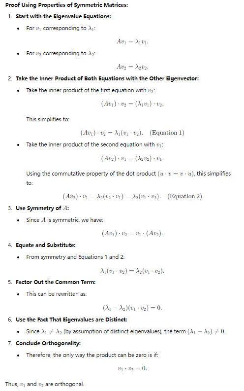
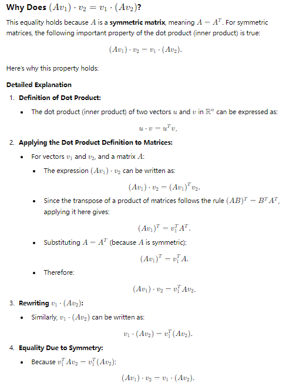

# Vectors and vector spaces
## Definition of Vectors: 
**A vector is an element of a vector space**. In $\mathbb{R}^n$, a vector is an **ordered** list of $n$ real numbers.
### Explanation:
- The notation $\mathbb{R}^n$ represents an ***n-dimensional Euclidean space***, which is the set of all $n$ of real numbers.
- **Ordered** means the sequence is important.
### Meaning of $\mathbb{R}$
- $\mathbb{R}$ denotes the set of all real numbers.
- $\mathbb{R}^n$ denotes the set of all **ordered** $n$-tuples (or vectors) of real numbers.
- Mathematically, an element $x$ in $\mathbb{R}^n$ can be written as: 
    
    $$x=(x_{1}, x_{2}, ..., x_{n})$$ 
    
    where each $x_{i}$ (for $i=1,2, ..., n$) is a real number $x_{i}\in\mathbb{R}$
- For example, in $\mathbb{R}^3$, each point is represented by an ordered triple of real numbers. $(-1, -2, 3)$ and $(4, 0, -1)$ are points in $\mathbb{R}^3$.

## Vector Spaces: 
A set of vectors, along with two operations (vector addition and scalar multiplication), that satisfies certain axioms (closure, associativity, distributivity, etc.). 
### Operations:
- Vector addition: If $x=(x_{1}, x_{2}, ..., x_{n})$ and $y=(y_{1}, y_{2}, ..., y_{n})$, then: 
    $$x+y=(x_{1}+y_{1}, x_{2}+y_{2}, ..., x_{n}+y_{n})$$
- Scalar Multiplication: If $\alpha\in\mathbb{R}$ and $x=(x_{1}, x_{2}, ..., x_{n})$, then: 
    $$\alpha{x}=(\alpha{x_{1}}, \alpha{x_{2}}, ..., \alpha{x_{n}})$$
- Dot product(Inner Product): The dot product of two vectors $x, y\in\mathbb{R}^n$ is given by: 
    $$x\cdot{y}=x_{1}y_{1}+x_{2}y_{2}+...+x_{n}y_{n}$$

## Basis and Dimension: 
**A basis of a vector space** is **a set of <u>*linearly independent*</u> vectors** that span the space. The **number of vectors in the basis** is called the **dimension** of the vector space.
### Linearly independent: 
- A set of vectors is called linearly independent if no vector in the set can be written as a linear combination of the others. In other words, the only way to express the zero vector as a linear combination of these vectors is by taking all the coefficients to be zero.
- Given a set of vectors $\{v_{1}, v_{2}, ..., v_{n}\}$ in a vector space $\mathbb{R}^n$, these vectors are **linearly independent** if the equation holds only when all the scalars $c_{1}, c_{2}, ..., c_{k}$ are zero:  
    $$c_{1}v_{1}+c_{2}v_{2}+ ... +c_{n}v_{n}=\vec0$$
    where $\vec{0}$ is the zero vector in the vector space.
- Geometric Interpretation:
  - In $\mathbb{R}^2$: Two vectors $v_{1}$ and $v_{2}$ are linearly independent if and only if they are not collinear (i.e., they do not lie on the same line through the origin). This means you **cannot scale one vector to get the other**.
  - In $\mathbb{R}^3$: Three vectors $v_{1}$, $v_{2}$ and $v_{3}$ are linearly independent if and only if they **do not lie in the same plane**. This means you cannot express any one of them as a combination of the other two.
- Examples
  - Consider the vectors $v_{1}=(1,0)$ and $v_{2}=(0,1)$ in $\mathbb{R}^2$
  - To check if they are linearly independent, suppose:
    $$c_{1}(1,0)+c_{2}(0,1)=(0,0)$$
    This simplifies to two questions:
    $$c_{1}\cdot{1}+c_{2}\cdot{0}=0\Rightarrow c_{1}=0$$
    $$c_{1}\cdot{0}+c_{2}\cdot{1}=0\Rightarrow c_{2}=0$$
    Since the only solution is $c_{1}=0, c_{2}=0$, the vectors are linearly independent

# Inner Product
## Definition
For two vectors $u,v\in\mathbb{R}^n$, the inner product is defined as
$$u\cdot{v}=u_{1}v_{1}+u_{2}v_{2}+...u_{n}v_{n}$$
## Property
- The inner product is commutative($a\times{b}=b\times{a}$), distributive($x\cdot{(y+z)}=x\cdot{y}+x\cdot{z}$), and associative($x\cdot{(y}\cdot{z)}=(x\cdot{y)}\cdot{z}$) with scalar multiplication. 
- It is also used to define the **length** (or **norm**) of a vector:
    $$\left|\left| v\right|\right|=\sqrt{v\cdot{v}}$$

# Matrices and Matrix Operations
## Matrix Multiplication
Know how to multiply matrices and understand that matrix multiplication is **not generally commutative** (i.e., $AB\not=BA)$
### Definition
If we have two matrices, $A$ and $B$, where:
- $A$ is of size $m\times{n}$(i.e., $A$ has $m$ rows and $n$ columns)
- $B$ is of size $n\times{p}$(i.e., $B$ has $n$ rows and $p$ columns)
  
then the product of matrices $A$ and $B$, denoted as $AB$, is defined only when the number of columns in $A$ matches the number of rows in $B$. The resulting matrix $C=AB$ will have dimensions $m\times{p}$
### Calculation
The element in the $i$-th row and $j$-th column of the resulting matrix $C$ is computed as:
$$C_{ij}=\sum^{n}_{k=1}A_{ik}B_{kj}$$
Examples:
- Consider two matrices $A$ and $B$:
$$A=\begin{bmatrix}
1 & 2 \\ 3 & 4
\end{bmatrix}, 
B=\begin{bmatrix}
5 & 6 \\ 7 & 8
\end{bmatrix}$$
- Matrix $A$ is $2\times{2}$, and matrix $B$ is $2\times{2}$. The product $C=AB$ will also be $2\times{2}$ matrix
- Compute each element of matrix $C$
  - $C_{11}=(1\times{5})+(2\times{7})=5+14=19$
  - $C_{12}=(1\times{6})+(2\times{8})=6+16=22$
  - $C_{11}=(3\times{5})+(4\times{7})=15+28=43$
  - $C_{11}=(3\times{6})+(4\times{8})=18+32=50$
Thus, the product matrix $C=AB$ is :
$$C=\begin{bmatrix}
19 & 22 \\ 43 & 50
\end{bmatrix}$$
### Properties
- Non-commutative: $AB\not=BA$
- Associative: $(AB)C=A(BC)$
- Distributive: $A(B+C)=AB+AC$
- Identity Matrix: $AI=IA=A$
### Special Cases
- Matrix by Vector $=$ Vector: If A is an $m\times{n}$ matrix and $x$ is an $n\times{1}$ column vector, the the product $Ax$ is an $m\times{1}$ column vector
- Multiplying Diagonal Matrices $=$ Diagonal Matrices

## Transpose of a Matrix
The transpose of a matrix $A$, denoted $A^\mathsf{T}$ is formed by flipping the rows and columns of $A$
### Properties
- $(A^\mathsf{T})^\mathsf{T}=A$
- $(A+B)^\mathsf{T}=A^\mathsf{T}+B^\mathsf{T}$
- $(AB)^\mathsf{T}=B^\mathsf{T}A^\mathsf{T}$. The transpose of the product of two matrices is the product of their transposes in **reverse order**
- $(cA)^\mathsf{T}=cA^\mathsf{T}$, where $c$ is a scalar.
- $(A^{-1})^\mathsf{T}=(A^\mathsf{T})^{-1}$. This is valid only if $A$ is an invertible (***<u>non-singular</u>***) matrix.

## Inverse of a Matrix
For a **<u>square matrix</u>** $A$, the inverse $A^{-1}$ is defined such that $AA^{-1}=A^{-1}A=I$, where $I$ is the identity matrix. The determinant should not be zero.
### Properties
- If a matrix $A$ is invertible, then its inverse $A^{-1}$ is unique.
- $(AB)^{-1}=B^{-1}A^{-1}$
- $(A^{-1})^\mathsf{T}=(A^\mathsf{T})^{-1}$
- $(cA)^{-1}=\frac{1}{c}A^{-1}$, where $c$ is a scalar.
- $(A^{-1})^{-1}=A$
- For a diagonal matrix $D=diag(d_{1}, d_{2}, ..., d_{n})$, the inverse $D^{-1}$ is also a diagonal matrix.
    $$D^{-1}=diag(\frac{1}{d_{1}}, \frac{1}{d_{2}}, ...., \frac{1}{d_{n}})$$
- If $Q$ is an ***<u>orthogonal</u>*** matrix, then its inverse  is equal to its transpose:
    $$Q^{-1}=Q^\mathsf{T}$$
### Calculation
For a $2\times2$ matrix, 
$$A=\begin{bmatrix}
a & b \\ c & d
\end{bmatrix}$$
the inverse of the matrix is given by:
$$A^{-1}=\frac{1}{\det{(A)}} \begin{bmatrix}
  d & -b \\ -c & a
\end{bmatrix}$$
**For larger matrices, will be more complex.**

# Orthonormality
## Orthogonal vectors
Two vectors $u$ and $v$ in a vector space are said to be orthogonal if their inner product (dot product) is zero:
$$u\cdot{v}=0$$
Orthogonality implies that the vectors are perpendicular to each other in Euclidean space.

## Normalized vectors
A vector $u$ is said to be normalized if it has unit length:
$$\left|\left|{u}\right|\right|=1$$
The norm of the vector $u=(u_{1}, u_{2}, ..., u_{n})$ is given by:
$$\left|\left|{u}\right|\right|=\sqrt{u_{1}^2+u_{2}^2+...u_{n}^2}$$

## Orthonormal vectors
A set of vectors is orthonormal if 
- each vector is of unit length (norm is 1);
- and any two different vectors are orthogonal(their product is 0).

## Orthonormal basis
- An orthonormal basis of a vector space is a basis(**<u>linearly independent</u>**) where all the vectors are orthonormal.
  - For example, in $\mathbb{R}^n$, the standard basis vector $e_{1}, e_{2}, ..., e_{n}$ form an orthonormal basis:
    $$e_{1}=(1,0,0, ..., 0), e_{2}=(0,1,0, ..., 0), ..., e_{n}=(0,0,0, ..., 1)$$
- These vectors satisfy both orthogonality and normalization:
    $$e_{i}\cdot{e_{j}}=\delta_{ij}$$
    where $\delta_{ij}$ is the **Kronecker delta**, which is 1 if $i=j$ and 0 otherwise.

## Properties
- A matrix $Q$ is called **orthogonal** if its columns(or rows) are orthonormal vectors. This implies:
    $$Q^\mathsf{T}Q=I  \  \ {or} \ \ QQ^\mathsf{T}=I$$
- A symmetric matrix can be orthogonally diagonalized, meaning there exists an orthogonal matrix $Q$ such that:
    $$Q^\mathsf{T}AQ=D$$

# Linear Transformations
## Definition
- A linear transformation is a mapping between vector spaces that preserves vector addition and scalar multiplication. Matrices represent linear transformations in a finite-dimensional vector space.
- Linear transformations can scale, rotate, reflect, or shear vectors. 线性变换实际上是对坐标系的变换，变换后作用于原向量。 = Interpret it as a certain transformation of space once you see a matrix.
## Operations
- Scaling: Change the size of vectors
    $$\begin{bmatrix}
     s_{x} & 0 \\ 0 & s_{y} 
    \end{bmatrix}$$
- Rotation: rotates cos\theta & -sin\theta \\ sin\theta & cos\thetavectors by $\theta$
    $$\begin{bmatrix}
      cos\theta & -sin\theta \\ sin\theta & cos\theta
    \end{bmatrix}$$
- Reflection: Flips vectors over a line or a plane
    $$\begin{bmatrix}
      -1 & 0 \\ 0 & 1
    \end{bmatrix} \ \ or \ \ 
    \begin{bmatrix}
      1 & 0 \\ 0 & -1
    \end{bmatrix}$$
- Shearing: slants vectors without preserving the angles
    $$\begin{bmatrix}
      1 & k \\ 0 & 1 
    \end{bmatrix} \ \ or \ \ 
    \begin{bmatrix}
      1 & 0 \\ k & 1
    \end{bmatrix}$$

# Determinants
## Definition
The determinant is a scalar value that can be computed from a **square matrix**. 

## Calculation
To calculate the determinant of a matrix, the method depends on the size of the matrix(e.g., $2\times{2}$, $3\times{3}$,  or larger)
- For a $2\times{2}$ matrix
    $$A=\begin{bmatrix}
      a & b \\ c & d
    \end{bmatrix}$$
    the determinant is calculated using the formula:
    $$\det(A)=ad-bc$$
- For a $3\times3$ matrix:
    $$A=\begin{bmatrix}
      a & b & c \\  d & e & f \\ g & h & i
    \end{bmatrix}$$
    the determinant is calculated using the cofactor expansion along any row or column. Typically, the first row is used:
    $$det(A)=a\begin{vmatrix}
      e & f \\ h & i
    \end{vmatrix} - 
    b\begin{vmatrix}
      d & f \\ g & i
    \end{vmatrix} + 
    c\begin{vmatrix}
      d & e \\ g & h
    \end{vmatrix}$$
    where each $2\times{2}$ determinant is called **minor**.
    $$det(A)=a(ei-fh)-b(di-fg)+c(eh-ge)$$
- For larger matrices $n\times{n}$
    * Choose a row or column with the most zeros to simplify calculations because for larger matrices, the computational cost is expensive.
    * Use Gaussian elimination to transform the matrix into an upper triangular form.
    * Example:
      * Consider the matrix:
        $$A=\begin{bmatrix}
          2 & 1 & 1 \\ 4 & -6 & 0 \\ -2 & 7 & 2
        \end{bmatrix}$$
        1. Perform row operations to get an upper triangular matrix:
           * $R_{2}=R_{2}-2R_{1}, \ R_{3}=R_{3}+R_{1}$
            $$\begin{bmatrix}
              2 & 1 & 1 \\ 0 & -8 & -2 \\ 0 & 8 & 3
            \end{bmatrix}$$
        2. Continue row reduction
           * $R_{3}=R_{3}+R_{2}$
            $$\begin{bmatrix}
              2 & 1 & 1 \\ 0 & -8 & -2 \\ 0 & 0 & 1
            \end{bmatrix}$$
        3. The determinant is the product of the diagonal elements
            $$det(A)=2\cdot{(-8)}\cdot{1}=-16$$
## Properties
- It provides important properties, such as whether the matrix is invertible (a non-zero determinant)
- For an orthogonal matrix $Q$, $\det{(Q)}=\pm1$
- $det(I)=1$
- $det(\begin{bmatrix}
  d_{1} & 0 & ... & 0 \\ 0 & d_{2} & ... & 0 \\ ... & ... & ... & ... \\  0 & 0 & ... & d_{n}
\end{bmatrix})=d_{1}d_{2}...d_{n}$
- $det(A^\mathsf{T})=det(A)$
- $det(AB)=det(A)\cdot{det(B)}$
- $det(A^{-1})=\frac{1}{det(A)}$
- If a matrix has two identical rows or columns, its determinant is zero

# Eigenvalues and Eigenvectors
## Definition
For a **square matrix** $A$ of size $n\times{n}$:
- A non-zero vector $v$ is called an eigenvector of $A$ if it satisfies the equation:
    $$Av=\lambda{v}$$
    where $\lambda$ is a scalar known as the eigenvalue corresponding to the eigenvector $v$

Attention:
  - **The eigenvector $v$ does not change direction under the transformation represented by $A$, it only gets scaled by $\lambda$.**

## Calculation: 
1. Finding the eigenvalues
   - Eigenvalues $\lambda$ are found by solving the characteristic equation:
        $$det(A-\lambda{I})=0$$
        This equation results in a polynomial of degree $n$ (known as the characteristic polynomial), which can be solved to find $n$ eigenvalues
2. Finding the eigenvectors
    - Once the eigenvalues $\lambda$ are determined, the corresponding eigenvectors $v$ are found by solving the system:
        $$(A-\lambda{I})v=0$$
        This system is a **homogeneous linear system**. The solutions to this system (excluding the trivial solution $v=0$) give the eigenvectors corresponding to the eigenvalue $\lambda$.

### Examples
Consider the matrix:
$$A=\begin{bmatrix}
  4 & 1 \\ 2 & 3
\end{bmatrix}$$
1. Find the Characteristic Equation
   $$det(A-\lambda{I})=det\begin{bmatrix}
    4-\lambda & 1 \\ 2 & 3-\lambda
   \end{bmatrix}$$
   The determinant is :
   $$(4-\lambda)(3-\lambda)-2$$
   Expand this:
   $$(4-\lambda)(3-\lambda)-2=12-4\lambda-3\lambda+\lambda^2-2=\lambda^2-7\lambda+10$$
   The characteristic equation is :
   $$\lambda^2-7\lambda+10=0$$
2. Solve for Eigenvalues
   - Using the quadratic formula $\lambda=\frac{-b\pm{\sqrt{b^2-4ac}}}{2a}$
   - $\lambda_{1}=5, \ \lambda_{2}=2$
3. Find the Eigenvectors
   - For $\lambda_{1}=5$, 
     - solve $(A-5I)v=0$:
        $$
          \begin{bmatrix}
              4 & 1 \\ 2 & 3
          \end{bmatrix}-5
          \begin{bmatrix}
              1 & 0 \\ 0 & 1
          \end{bmatrix})
          \begin{bmatrix}
              x \\ y
          \end{bmatrix}=
          \begin{bmatrix}
              0 \\ 0
          \end{bmatrix}
        $$
      - This simplifies to:
          $$
          \begin{bmatrix}
            -1 & 1 \\ 2 & -2
          \end{bmatrix}
          \begin{bmatrix}
            x \\ y
          \end{bmatrix}=
          \begin{bmatrix}
            0 \\ 0
          \end{bmatrix}
          $$
      - From the first row: $-x+y=0\Rightarrow y=x$. Let $x=1$, then $y=1$. An eigenvector corresponding to $\lambda_{1}=5$ is
          $$v_{1}=\begin{bmatrix}
            1 \\ 1
          \end{bmatrix}$$
   - For $\lambda_{2}=2$, 
     - Solve $(A-2I)v=0$:
        $$
          \begin{bmatrix}
              4 & 1 \\ 2 & 3
          \end{bmatrix}-2
          \begin{bmatrix}
              1 & 0 \\ 0 & 1
          \end{bmatrix})
          \begin{bmatrix}
              x \\ y
          \end{bmatrix}=
          \begin{bmatrix}
              0 \\ 0
          \end{bmatrix}
        $$
      - This simplifies to:
          $$
          \begin{bmatrix}
            2 & 1 \\ 2 & 1
          \end{bmatrix}
          \begin{bmatrix}
            x \\ y
          \end{bmatrix}=
          \begin{bmatrix}
            0 \\ 0
          \end{bmatrix}
          $$
      - From the first row: $2x+y=0\Rightarrow y=-2x$. Let $x=1$, then $y=-2$. An eigenvector corresponding to $\lambda_{1}=2$ is
          $$v_{2}=\begin{bmatrix}
            1 \\ -2
          \end{bmatrix}$$

## Properties
1. The sum of the eigenvalues of a matrix $A$ is equal to the trace(the sum of its diagonal elements) of $A$:
   $$\sum^{n}_{i=1}\lambda_{i}=Tr(A)$$
2. The product of the eigenvalues of a matrix $A$ is equal to the determinant of $A$
   $$\prod^{n}_{i=1}\lambda_{i}=det(A)$$
3. ***[TBD]*** If a matrix has ***distinct eigenvalues***, its corresponding eigenvectors are ***linearly independent***.
4. For Diagonal Matrix and Triangular Matrix, the eigenvalues are the elements on the main diagonal.
5. If $\lambda$ is an eigenvalue of $A$, then $\frac{1}{\lambda}$ is an eigenvalue of the matrix $A^{-1}$, provided $A$ is invertible.
6. The eigenvalues of a matrix $A$ and its transpose $A^{\mathsf{T}}$ are the same.
7. ***[TBD]*** If $A$ and $B$ are similar matrices (i.e., $A=PBP^{-1}$), they have the same eigenvalues.
8. ***[TBD]*** If $Q$ is an orthogonal matrix, its eigenvalues lie on the unit circle in the complex plane; they have a magnitude of 1.
9. ***[TBD]*** A real symmetric matrix $A$ can be orthogonally diagonalized; it has real eigenvalues, and there exists an orthogonal matrix $Q$ such that $Q^{\mathsf{T}}AQ=D$, where $D$ is a diagonal matrix with eigenvalues on the diagonal.

# Orthogonal Diagonalization
Orthogonal diagonalization is a process used to diagonalize a symmetric matrix using an orthogonal matrix. Diagonalization simplifies many matrix computations and provides insights into the properties of linear transformations.

A matrix $A$ of size $n\times{n}$ is said to be orthogonally diagonalizable if there exists an orthogonal matrix $Q$ and a diagonal matrix $D$ such that:
$$A=QDQ^{\mathsf{T}}$$
or equivalently:
$$Q^{\mathsf{T}}AQ=D$$
where A is a symmetric matrix, D is a diagonal matrix, and Q is an orthogonal matrix.
## Steps for orthogonal diagonalization
Input: A symmetric matrix $\Rightarrow$ Output: A diagonal matrix & An orthogonal matrix
1. Find the Eigenvalues and Eigenvectors of $A$
    - Solve $det(A-\lambda{I})=0$ to find eigenvalues $\lambda_{1}, \lambda_{2}, ..., \lambda_{n}$
    - For each eigenvalue $\lambda_{i}$, find the corresponding eigenvector by solving $(A-\lambda_{i}{I})v=0$
2. Normalize the Eigenvectors
    $$v=\frac{v}{\left|\left|{v}\right| \right|}$$
3. Form the Orthogonal Matrix by using normalized eigenvectors as columns
    - Since the eigenvectors are orthonormal (orthogonal and of unit length), $Q$ will be orthogonal.
4. Construct  the Diagonal Matrix.

## Properties
1. Only symmetric matrices can be orthogonally diagonalized.
2. Eigenvectors corresponding to distinct eigenvalues of a symmetric matrix are orthogonal. [Proof 1]

# QR Decomposition
QR decomposition (or QR factorization) is a technique in linear algebra that decomposes a matrix into a product of two matrices: an orthogonal (or unitary) matrix and an upper triangular matrix. This decomposition is widely used in numerical methods, particularly for solving linear systems, eigenvalue problems, and least squares fitting.
## Definition
For a given matrix $A$ of size $m\times{n}$ (with $m\ge{n}$), the QR decomposition is:
$$A=QR$$
where $Q$ is an $m\times{n}$ orthogonal matrix, meaning $Q^{\mathsf{T}}Q=I$, and $R$ is an $m\times{n}$ upper triangular matrix

## Calculation
- Gram-Schmidt process

## Properties
To be continued

# Knowledge to backup
1. Orthogonal matrix: A real square matrix whose rows and columns are orthonormal vectors.  $Q^{\mathsf{T}}Q=I$
2. Diagonal matrix: A matrix in which the entries outside the main diagonal are all zero; the term usually refers to square matrices. **Eigenvalues are on its diagonal.**
3. Symmetric matrix: A matrix that is equal to its transpose. $A^{\mathsf{T}}=A$
4. [Proof 1]

   
   
   - For the point 3 in the Proof 1, proof 1-1 is presented 
    
    [Proof 1-1]

    
