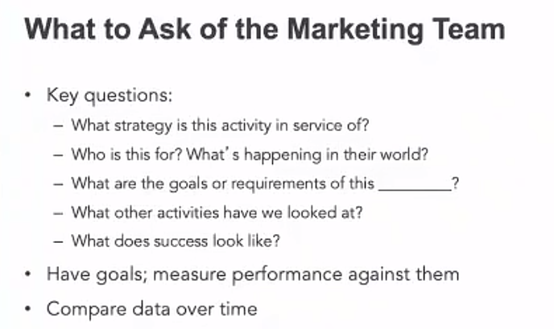
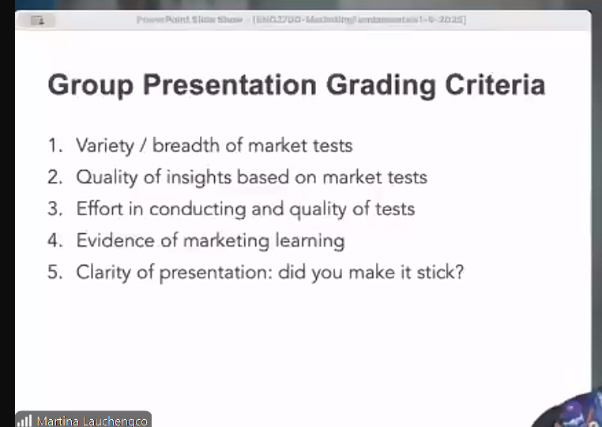

### Lecture 1:
1. Marketing is to create a context for buyers to enhance their willingness to purchase the product.
2. 4 P's: Price, Promotion, Places

### Lecture 2: Minimal Viable Product
1. Promote a novel design bike: ElliptiGO
   * Prioritize who: cyclist, runner(injured, change another way), fitness enthusiast
   * Prioritize where: local bike store(for bike service and infrastructure), internet, running store
   * The most important way for conversion: trial, endorsement(much more important)
   * Prioritize geographies: california, national, int'l
   * Price costs $900 to produce: 1799, 2199, 3499
2. Market test: real things with real people
3. Minimum Viable Product help start the process of learning as quickly as possible
4. Validated Learning: 
   1. Value Hypothesis -> test whether a product or a service delivers real value to customers once they are using it.
      * Should not presume, do customers recognize they have the problem you are solving
   2. Growth Hypothesis -> how will new customers discover us in a way that achieves sustainable growth

### Lecture 3: Ideas and Inspiration
1. A prototype is a preliminary version of a product or service, while a pretotype is a quick experiment to test ideas
2. Entrepreneurship is to apply innovation to bring new ideas to fruition. Persistence + Inspiration
3. Use full time to brainstorm to add as much ideas as possible. Set a timer and get ideas.

### Lecture 4
1. Use 6 principles when branding and ads
2. https://gamma.app/ to create a branding idea
3. 

### Lecture 5
* Grading Criteria
    