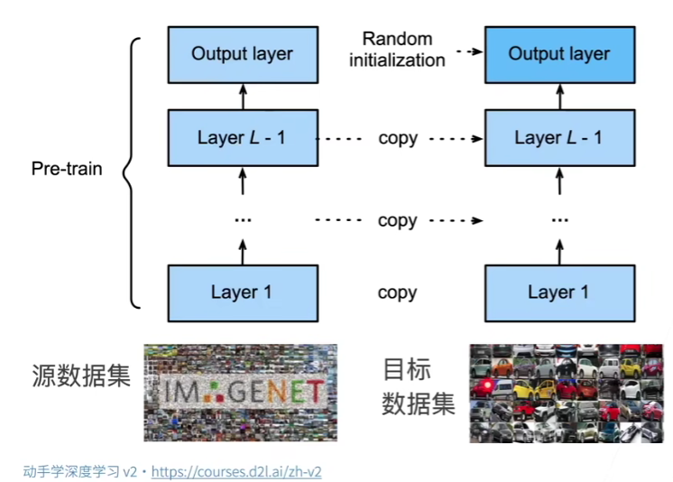
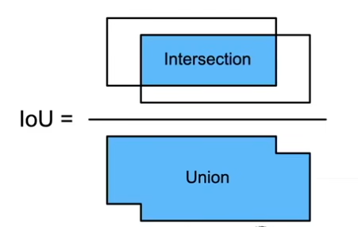
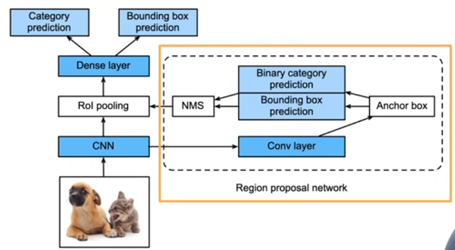

## Fine-tuning
### Intuition
1. It's expensive to label a dataset.
2. For human, if I have seen a lot of objects, it will be easy for me to remember/recognize a new one.

### Method
1. Models trained on large dataset have terrific ability to extract feature.
2. Neural network for classification = Feature extractor + Classifier:
   1. Feature extractor: Turn **initial pixels space** into **features space** that are easy to linearly segment.
   2. Classifier: Linear classifier for classification. 
3. We can potentially utilize the feature extractor and revise the classifier for our tasks.

### Training
1. Initialize with the pre-trained model:
    
2. 正常训练 with larger regularization, i.e.
      1. Smaller learning rate
      2. Less data for iteration
    
    In this way, we will not change too much from the pre-trained model.
3. When source dataset is far more complicate than target dataset, fine-tuning will have better effect. Otherwise, just directly train a new model.

### Tips
1. If we have some same labels as the source dataset, we can reuse the weight vectors for initialization.
2. Lower features are more generalized, while higher features are more related to the dataset. Thus, we can freeze some layers without update when fine-tuning.
   1. Lower features are those closer to the input.
   2. Higher feature are those closer to the classifier.

## Object detection
### Intuition
Detect the category and positions of all objects.

### Foundation
1. Bounding box
   * (left_up_x, left_up_y, right_bottom_x, right_bottom_y)
   * (left_up_x, left_up_y, width, height)

2. Dataset
   * One object per line: file_name, category, bounding_box 
   * Classic dataset: COCO (80 classification, 330K images, 1.5M objects)

### Methods
One type of object detection algo is based on anchor box.

#### Anchor boxes
1. Proposing several anchor areas
2. Predict whether there's a target object in the anchor area
3. If yes, predict the position bias with the true bounding box
    * 这里的bias并非直接将两个box坐标相减，而是对中心点和高宽进行相对处理
    * 最终的Offset分布，要尽量均值为0，分布的比较开，会更容易预测。

#### IOU
For solving the step two in anchor boxes, we use **IOU** to calculate the similarity between two boxes.
* 0 is no overlap, 1 is overlapped.
* $J(A,B)=\frac{|A\cap{B}|}{|A\cup{B}|}$

    

#### Label anchor boxes
每读取一次image，就要对这张图片生成一些anchor boxes，所以图片一张张读
1. Every anchor box is a training sample.
2. During the training, every anchor should either be labeled as background or related to a true a bounding box.
3. We may have huge amounts of negative sample.
4. 将所有的真实bounding box和所有生成的anchor box计算IOU
5. 对某一个bounding box来说，它会关联到IOU最大的anchor box
6. 接下去不看已经被关联的bounding box和anchor box，继续找最大IOU，直至所有bounding box被关联。

#### 非极大值预测NMS
As 每个anchor box预测一个bounding box，NMS可以合并相似的预测，从而去掉冗余的anchor box。
1. Pick 非背景类的最大预测值
2. 去掉所有其他和它IOU值大于threshold的预测
3. 重复上述过程直到所有anchor box要么被选中要么被删掉

### Other methods summary
#### RCNN 系列 -> 精度要求高的场景
1. 启发式搜索算法选择anchor box
2. 将每个anchor box当成一张图片，用预训练模型对每个anchor box抽取特征
   1. RoI池化层让每个anchor box变成相同尺寸
3. 训练一个SVM进行分类
4. 训练一个线性回归模型预测bounding box offset

问题：一张图片变成1000张小图片，抽特征的计算量太大

#### Fast RCNN
1. 对整张图片CNN抽特征
2. selective search选anchor box
3. 将它们映射到CNN的输出上
4. 再进行RoI pooling
5. 全连接线性回归（不需要SVM一个个去分类）

#### Faster RCNN & Mask RCNN
用一个小网络选择anchor box替代selective search. 粗一点的Object detection

Mask RCNN会用像素级别的信息guide anchor box的选择

#### SSD(Single Shot Detection)
对不同分辨率下的图片进行detection，固定anchor box的size，随着图片不断被压缩，底部识别小物体，越往上识别大物体

#### YOLO
Previous work中，相邻像素之间的anchor box会产生overlap。
1. YOLO均匀将图片分成了SxS个anchor box
2. 每个anchor box预测B个边缘框。In case有B个物体都和当前的anchor box很近
3. 后续版本的改进：真实的bounding box在数据集中出现是有一定规律的，因此可以先聚类bounding box看特点。