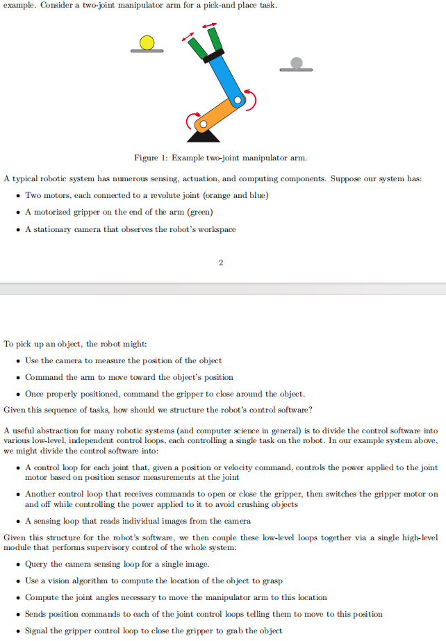
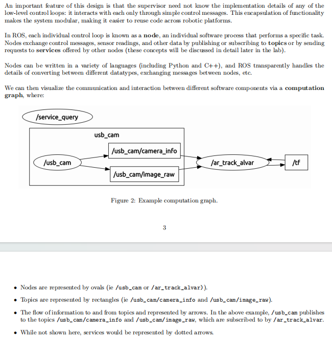
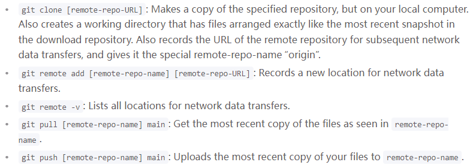

# What is ROS



# Foundations of Configuration, File Organization and Packages
- Node - an **executable** representing an individual ROS **software process**
    - Message - a ROS **datatype** used to exchange data between nodes
    - Topic - a **channel** where nodes can *publish* messages to a topic and/or *subscribe* to a topic to receive messages
* The contents of `~/ros_workspaces` directory
  * `/src` - source code for ROS nodes
  * `/devel` - binary executable and heder files
  * `/build` - information to build packages
* The use of `catkin_make` command, running from the workplace directory
  * Build the package in this workplace
  * Create directories and run `cmake` command -> compile
* The content of a `package.xml` file
  * Package name
  * Dependencies: buildtool_depend, build_depend, run_depend
* The use to ROS's utility functions to find the path of a package
  * `source [yourWorkplace]/devel/setup.bash`
  * `rospack find [package_name]`


## Initial configuration
1. Set up workplace. Clone the repo of *ros_workspaces*
2. Rename the remote from "origin" to "starter". ```git remote rename origin starter```
3. Pull updated starter code, execute the command ```git pull starter main```


    [More info about Git](https://sp24.datastructur.es/resources/guides/git/)

## ROS file system
1. The basic unit of software organization in ROS is the **package**, a folder containing executables, source codes, libraries, and other resources.
2. ```/opt/ros/eecsbot_ws/src/baxter_examples``` is an example package for the Baxter robot SDK.
    - package.xml - metadata, config, dependencies
    - /src - source code for ROS nodes provided by the package
    - /launch - launch files that start and config ROS nodes wit specific parameters
    - /scripts - executable scripts, interact with nodes

## File system tools
Config env variable first in the same terminal by `source /opt/ros/eecsbot_ws/devel/setup.bash`
1. `rospack find [package_name]` to find a specific package, returning information about it.\
2. `rosls [directory_name]` and `roscd [directory_name]`

## Creating a workplace
1. All ROS code must be contained within a package in a *workplace*.
    - Usually contains a directory *src* to store ROS code
2. ROS uses the *catkin* tool to build all code in a workplace, after fill /src with packages, run `catkin_make` command from the workplace directory.
    - After that, two new directories `devel`(binary executable and heder files) and `build`(information to build packages) will exist alongside `src`


## Creating a new package
1. In the `src` of the workplace, run `catkin_create_pkg [package_name]`. 
    - The only dependencies in this case is *catkin* tool itself by examining `package.xml` in the directory.
2. Try another example by running `catkin_create_pkg [package_name] rospy roscpp std_msgs turtlesim`
    - Several dependencies are  added

## Building a package
1. Once adding resources to the new package, the last step before using the package with ROS is *build*
2. Run `catkin_make` from the `lab1` directory.
3. The `devel` directory contains the script `setup.bash`, generated by `catkin_make`.
4. `Source` this `setup.bash` will prepare the shell env for using the ROS packages contained in this workplace.
5. *Any time use a non-built-in package, we need to source the **devel/setup.bash** file for that package's workplace*
> - `Shell` refers to the program that provides a command-line interface for interacting with an operating system
> - `Bash`(Bourne-Again SHell) is one of the most commonly used Linux Shells.

**[TRY THIS]**
```
echo $ROS_PACKAGE_PATH
source devel/setup.bash
echo $ROS_PACKAGE_PATH
```

# ROS Nodes, Topics, and Services
You will learn:
* What a node, topic, and message are.
    - Node - an **executable** representing an individual ROS **software process**
    - Message - a ROS **datatype** used to exchange data between nodes
    - Topic - a **channel** where nodes can *publish* messages to a topic and/or *subscribe* to a topic to receive messages
* Drive the turtle
* Use ROS's function to view data on topics and messages
    - `rostopic echo /turtle1/cmd_vel[topic_name]`
## ROS nodes
0. Key components:
    - Node - an **executable** representing an individual ROS **software process**
    - Message - a ROS **datatype** used to exchange data between nodes
    - Topic - a **channel** where nodes can *publish* messages to a topic and/or *subscribe* to a topic to receive messages
1. Run `roscore`
    - A centralized server for managing nodes, topics, services, communication.
    - The main entry point & the first for running any ROS system
2. Leave `roscore` running and open a second terminal.
3. See currently running nodes by running `rosnode list`
4. Get more information about the node by running `rosnode info /rosout[node_name]`

## Running turtlesim
1. To start additional nodes, use `rosrun [package_name] [executable_name]`
2. In turtlesim case, run the `turtlesim_node` executable, which is located in the `turtlesim` package. Run `rosrun turtlesim turtlesim_node`
3. A turtlesim window will appera.
4. Run `rosnode list` and `rosnode info /turtlesim` again.


## ROS Topics
1. Leave `roscore` and `turtlesim_node`, which are two nodes, open.
2. Run another executable in the turtlesim package by `rosrun turtlesim turtle_teleop_key`
3. Drive the turtle with arrow keys
4. Run `rosrun rqt-graph rqt-graph` to visualize the current computation graph
    - The direction of the arrow represents the publisher to the subscriber
    - The `topic` is shown on the arrow
5. Take a closer look at the `/turtle1/cmd_vel` topic using `rostopic echo /turtle1/cmd_vel` command. 
6. Refresh the rqt-graph, another node "viewing a topic" will appear.
7. Run `rostopic list` and `rostopic list -v` to view all the topics published or subscribed to by any code.

## ROS service
Topics are typically used to exchange a continuous stream of data, the service allows one node to *request* data from another node and receive a *response*. Requests and responses are to services as messages are to topics.
1. Show all the services offered by currently running nodes by `rosservice list`
2. Check the service type for `/clear` service by `rosservice type /clear`
3. Call the service by `rosservice call [service] [arguments]`
    - eg1: `rosservice call /clear` without any arguments
    - eg2: Run `rosservice type /spawn` to find the datatype of `/spawn` service. Then run `rospack find turtlesim` to locate the turtlesim package. Then open the `Spawn.srv` service definition, located in the package's /srv subfolder. Finally, call the `/spawn` service to create a new turtle by `rosservice call /spawn 2.0 2.0 1.2 "newturtle"`


## Write publisher and subscriber Nodes
### Key takeaways
1. `rosservice call /service [arg1] [arg2] [arg3]` is equal to `rosrun [pkg_name] [clientFileName].py`
2. Every time revise the `.msg` or `.srv` file, remake the whole directory.
3. If you want to use a msg data type, remember to import it in your py file.
    - e.g. `from my_chatter.msg import TimestampString`
4. service is a double-communication channel, while message is single-communication channel.