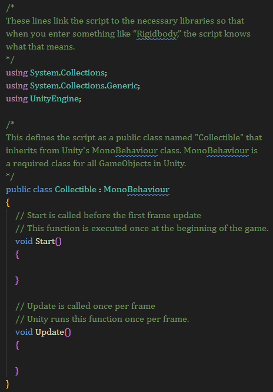

# Install Unity 
1. First download Unity Hub at https://unity.com/download. A file will download named **UnityHubSetup.exe**
2. Launch the installer and follow the instruction to install and launch Unity Hub
3. Install the Unity Editor(**2022.3.43f1 LTS** for mine) as shown in the Unity Hub, which will take a while.
4. Download and open the [Unity Essentials Project](https://unity-connect-prd.storage.googleapis.com/20240813/5c857af5-ff52-4283-95b5-9798751e8501/Unity_Essentials_Download.zip) from Unity Hub.

# Editor Essentials
1. Unity Editor Windows:
    - Project Window: display files and assets
    - Hierarchy Window: show the scene structure
    - Scene View & Game View: navigate and edit & allow for real-time testing
    - Inspector window: provide detailed info
2. Navigate the Scene View
    - Press **F** key to frame the selected object
    - **Right mouse button + WASD** keys to enable flythrough mode
    - Press **alt** and click to orbit around an object
    - Perspective mode and Isometric mode (all objects are rendered at their actual size)
3. Move and Rotate
    - Press **W** key to activate **Move** tool
    - Press **E** key to activate **Rotate** tool

# 3D Essentials
1. Add instance of prefabs. and Transform component to position a GameObject
2. Create and edit own Material, use Physical Material, and add Rigidbody component.
      -  The **Transform** component sets position, rotation, and scale of the ball.
      -  The **Mesh Filter** component determines the shape of the GameObject by using 3D model mesh which is a wireframe.
      -  The **Mesh Render** controls the external appearance of the ball, we need to find the material applying to the ball.
      -  The **Sphere Collider** component defines the physical boundaries of GameObjects for collision purposes, relating to Physics Material.
      -  The **Mesh Collider** component adds physical properties for mesh.
      -  The **Rigidbody** component integrates the ball into Unity's physics system.
3. Arrange GameObjects in parent-child relationships and save it as prefabs.
4. Ctrl+Shift+F aligns the camera with my current view.

# Audio Essentials
1. One tip for this part is that you need ensure the audio clip in the asset end with .mp3, or the import module will raise an issue and you cannot find it in audio source component.
2. More audio in [Unity Asset Store](https://assetstore.unity.com/)

# Program Essentials
1. The structure of the default script

    
2. Use generative AI to simulate anything.

# 2D Essentials
1. main camera is in orthographic mode instead of perspective mode of 3D scene.
2. it can be helpful to use the aspect ratio that your game's users will see on their devices
3. Add circle collider and square collider respectively.

# Reference
1. [Tutorial to Unity](https://learn.unity.com/tutorial/unity-essentials-install-unity-1?pathwayId=664b6225edbc2a01973f4f19&missionId=664bdda6edbc2a09177bccae#66509becedbc2a2cd2c75bff)