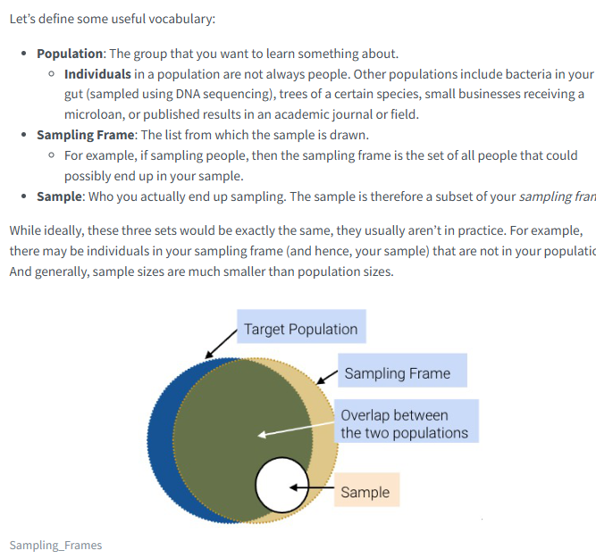
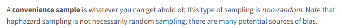
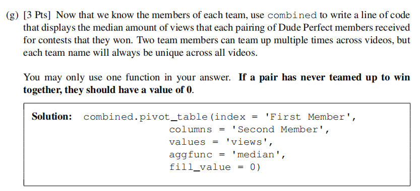
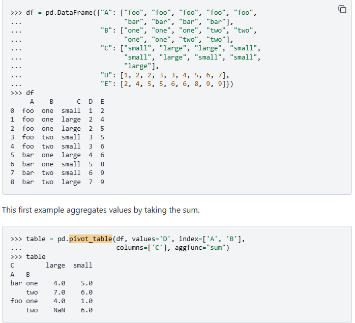
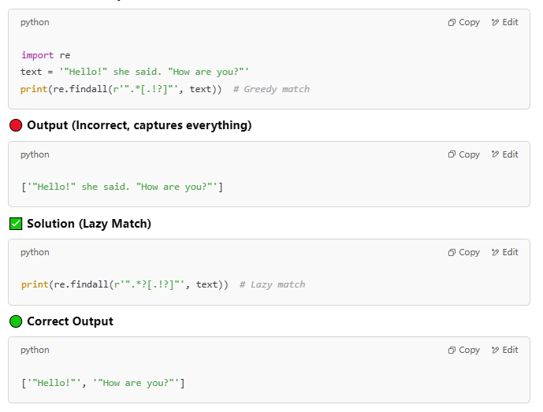
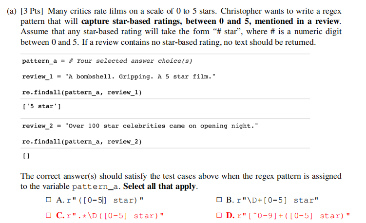
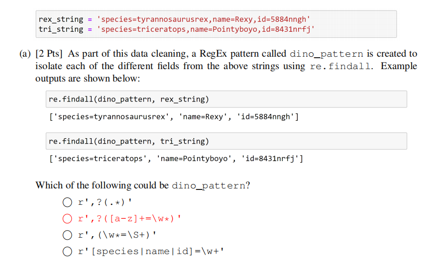
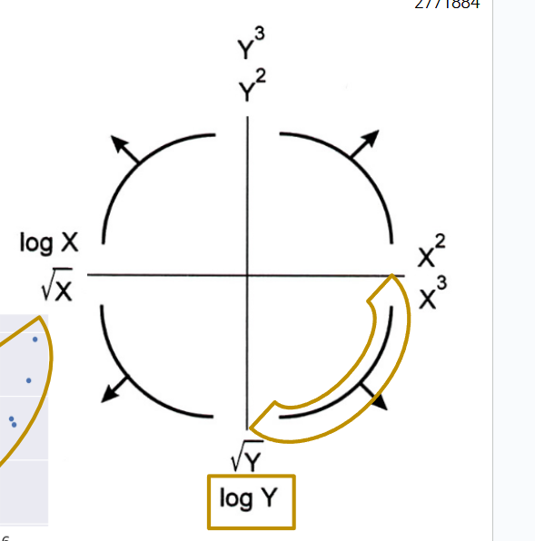
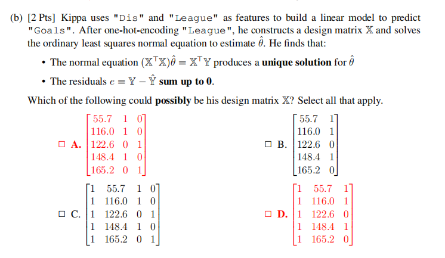

## Mid-term
### Sampling

* Sampling Frame: The set of people that could **possibly** end up in the sample

#### Type of Sampling

In a **probability sample**, we provide the chance that any specified set of individuals will be in the sample (individuals in the population can have different chances of being selected; they don’t all have to be uniform), and we sample at random based off this known chance. For this reason, probability samples are also called random samples
* Probability Sampling: We can find the specific chance that any set of individuals will be
in the sample. The probability of every 100th individual being in the sample is 1; for all
others, it’s 0.

A uniform random sample with replacement is a sample drawn uniformly at random with replacement.
* Some individuals in the population might get picked more than once.
> Random Sample without Replacement: This is not a random sample, as not every individual has the same probability of being chosen.
> Random Sample with Replacement: This is not a random sample, as not every individual has the same probability of being chosen. Additionally, this is not being conducted with replacement.

A simple random sample (SRS) is a sample drawn uniformly at random without replacement.
* Every individual (and subset of individuals) has the same chance of being selected from the sampling frame.
* Every pair has the same chance as every other pair.
* Every triple has the same chance as every other triple.
And so on.
* **Non-responsive bias -> $p$(disagree to participate) $\neq$ $p$(agree to participate)**

A stratified random sample, where random sampling is performed on strata (specific groups), and the groups together compose a sample.

#### Forms of error and bias
* Chance Error: Random sampling
* Non-response Bias: Exists because individuals may be unresponsive to our phone call.
* Selection Bias: systematically excludes (or favors) particular groups
* Response bias: occurs because people don’t always respond truthfully. Survey designers pay special detail to the nature and wording of questions to avoid this type of bias. for survey, those with strong feelings (positive or negative) are often more likely to respond.

### Pandas
> Deal with `DataFrame`, `Series`, and `Index`
> 
> Accessors: 
> * `df[columns]`
> * Boolean filtering(Pass in an array of True/False or `Series.isin(values)`)
> * `df.loc[]` (use row index and column name, include the end index) and `df.iloc[]` (use row/col position, exclude the end index)
> 
> Groupby:
> * Return a temporary subDataFrame that group by colname
> * Must use `agg` function to return a dataframe, the index will be the colname
> * for `'count'`, it excludes missing values while `'size'` includes missing values
> * `groupby(...).filter(f)` takes a DataFrame as argument, copying the original DataFrame and only returning all rows from groups that is True from `f`
>
> Pivot: returns a Dataframe that transforms the values in a column into column labels
>
> Merge: performs a merge on two data tables
>
> String Operation: `Series.str....`
1. Get the mean of the `Height` column. `pandas_df["Height"].mean()`
2. Check if the element in a column of a dataframe is in the given list. `pandas_df["Favorite Food"].isin(SELECT_FOODS)`
3. Distinguish the difference between `agg` and `filter`. When we want to `only keep` rows or `remove` rows, use `filter` which is processing `x` in `lambda x` as DataFrame.
4. The number of rows in the subframe after grouping is `len(sf)` or `sf.shape[0]`
5. `sort_values(ascending=True)` while `value_counts(ascending=False)`
6. `df.groupby("column").agg('sum')` is adding up number for each cell not counting!!! For counting, pick one column and `agg('count')`
7. `pivot_table`

1. [Fall23]sum(Series) == Series.sum(), which adds up all cells together. However, for Series with True and False, it will return True counts.
2. [Fall23]After `groupby`, to `agg` on different columns, use `{"Guess": "count", "Correct": "sum"}`

### Regex
1. How to match multiple same pattern
    
2. This problem tests the concept of capturing groups. To answer this question, we need to recognize that if capturing groups are present in the pattern, re.findall will return only the characters contained in the capturing group. Otherwise, it will return all matched characters.

    
3. [Fall23] `[]` just matches specific letter in it rather than a word.
4. [Fall23] The reason why a is not correct is because `,` will not stop the matching of `.*`. While, `\w+` will stop at `,`
    

### Visualization
#### Distribution
* Single Numeric Distribution
  * Histogram: Shows the frequency/count of values in bins.
  * KDE Plot (1D): A smooth estimate of the distribution’s shape.
  * Box Plot / Violin Plot: Shows quartiles, outliers, or distribution shape.
* Relationship Between Two Numeric Variables
  * Scatter Plot: Plots each observation in 2D space. Good for seeing correlation, clusters, outliers.
  * Hexplot: Like a 2D histogram, bins the (x, y) plane into hexagons, showing density for large datasets.
  * 2D KDE Plot: A smooth density estimate in 2D, often shown as contour lines or heatmaps.
* Categorical vs. Numeric
  * Bar Chart: For comparing averages or counts across categories.
  * Box/Violin Plot by Category: For comparing distributions of a numeric variable across categories.
* `sns.histplot(data=dataframe, x="Wait Time", rug=True, kde=True, stat="density")` where rug is small sticks on the graph
#### KDE
  * Steps:
    1. Locate the data point
    2. Plot the Gaussian kernel for each point
    3. Downscale the height
    4. Sum the height
  * The sum of the area in KDE curve is 1. **Pay attention to the value on x-axis**
  * Before scaling, each area is 1. After scaling, each area is $\frac{1}{n}$
  * The kernel is centered at each individual point.
  * Boxcar Kernel is a piecewise constant function with vertical jumps (no sloped or curved segments).
  * Gaussian Kernel: A larger bandwidth makes each bump wider and thus produces a smoother, more gently varying curve (fewer lumps). A smaller bandwidth makes each bump narrower, often revealing **more** local peaks.
    * If $\alpha$ goes to 0, the plot will be many sticks, while $\alpha$ goes to infinity, it will be a plane aligning with x axis.
#### Side-by-side box:
  * Median: the line split the box
  * Interquartile range: the edges of the box marking the first (Q1) and third quartiles (Q3).
  * whiskers: The lines extending from the box, called whiskers, show the range of the data, typically extending to the minimum and maximum values that are not outliers. 
  * Left Whisker: $Q1 - 1.5\times(IQR)$ Right Whisker: $Q3 + 1.5\times(IQR)$
* `Mode` is where the peak of the curve is.
#### Data Transformation
1. We expect the **residual** plot of a good-performing **linear model** to display **no clear trends**. However, there is a clear pattern present in the residual plot (the scatter points are in a roughly parabolic shape)
2. In the plot of residuals,
    * if almost all points are above 0, meaning the $y$ is consistently higher than $\hat{y}$, which is underpredicting.
     * if there's trend or pattern in the plot, indicating need linearization
     * Sum of residuals not 0 may not mean an intercept term is missing. The model may just be biased. 
3. Tuckey Mosteller Diagram

    

### Modeling
> Linear regression, what is linear.
> Loss Function: MAE, MSE
> Minimizing loss: Derivative, set to 0, rearrange
> For constant model, we will have the $\hat{\theta}=mean(y)$ using MSE and the $\hat{\theta}=median(y)$ using MAE
>
> Multiple Linear Regression
1. If there's always a unique solution to the optimal parameters $\hat{\theta}$ that minimize MSE?
   * No. See if columns of the design matrix of the model is linearly independent. If so, **$X^TX$** is invertible(**Not $X$ itself**), and the optimal solution exists. Otherwise, not exist.
   * Linearly dependent -> not full rank -> not invertible -> no unique optimal
2. Why is the critical point found in Part (c) guaranteed to be a minimum and not a maximum?
   * The critical point of a convex function is always a minimum. Because MSE is a convex function, the critical point occurring at the value of $\theta$ calculated in Part (c) is guaranteed to be a minimum.
3. The design matrix contains a column of bias!!! So the number of features + 1
4. The residual vector is a $n\times{1}$ vector where $n$ is the number of samples, representing the the errors in prediction per sample.
5. The sum of the residuals $\sum_{i=1}^n{e_i}$ in Ordinary Least Squares regression is not necessarily when there's no intercept(all ones column)
6. $H=X(X^TX)^{-1}X^T$, then $HH=X(X^TX)^{-1}X^TX(X^TX)^{-1}X^T=X(X^TX)^{-1}$ $(X^TX)$ $(X^TX)^{-1}X^T=X(X^TX)^{-1}X^T=H$
7. C is ruled out, because the first, third, and fourth columns are not linearly independent in this case.
 
8. OLS only works with MSE
9. $\hat{\theta}$ is not minimizing the sum of the residual of $Y-\hat{Y}$, but the MSE