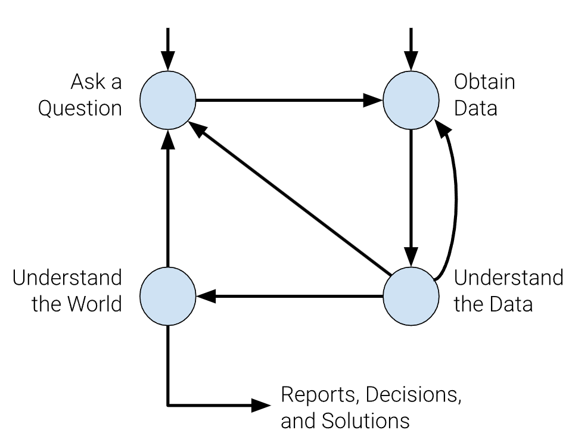
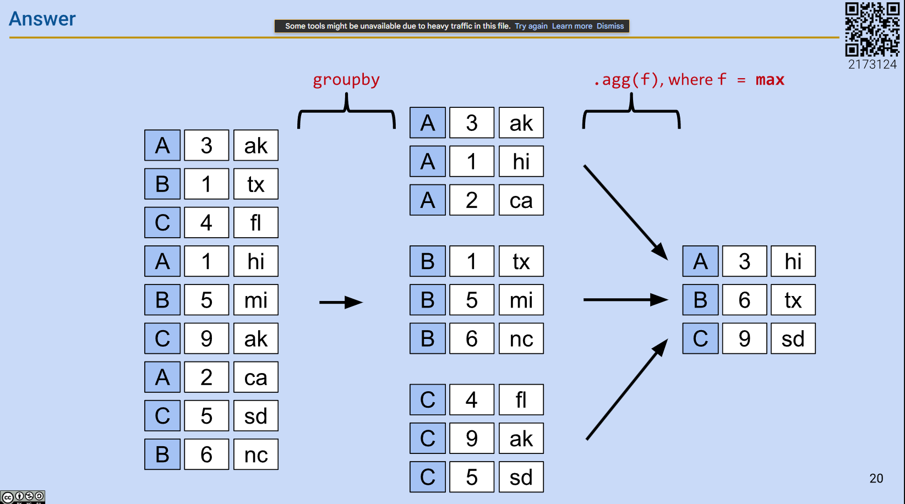
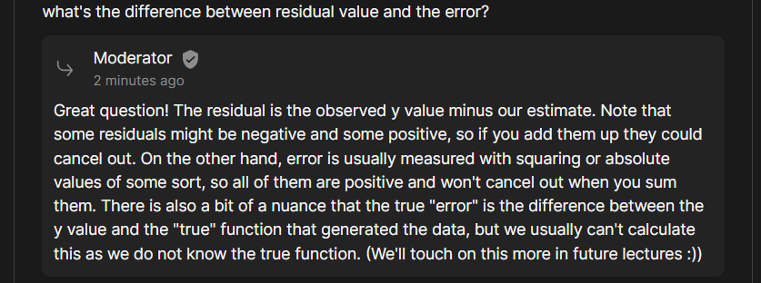
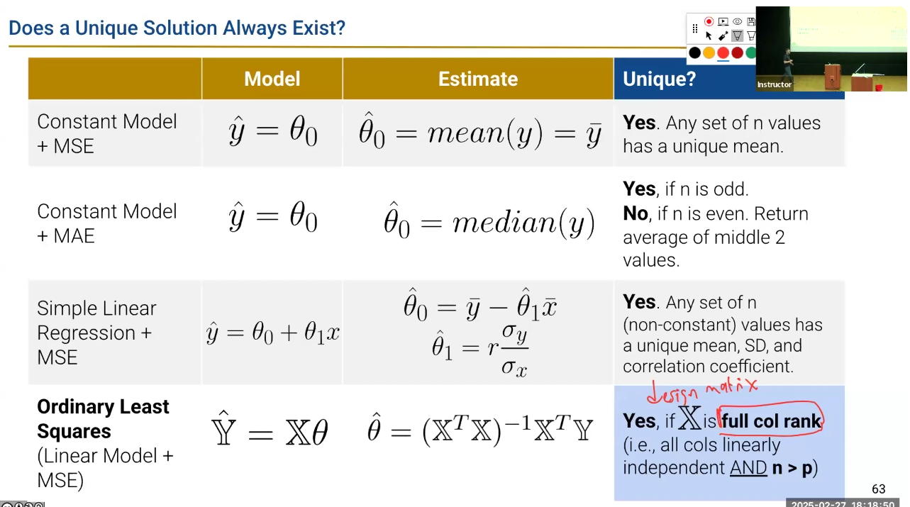

## Lecture 1
### Logistics
1. slido.com and the number is 3625952

### Intuition from case study of audited tax
Tax audited? how IRS know the race of taxpayers? How do we know who was audited? -> Data from IRS
* Race not reported anywhere in tax return.
* The prevalence of hometowns first names, last names differs across race and ethnicity. Visualize the factor as x axis and audited rate as y axis.
    * Race from hometown: NYC and SF. SF indicates higher probability that residents are identified as asian.
    * First name and last name: probability of particular name that is identified as black, asian, etc.
    * Income: single variable does not fully explain the gap in lower income data.
* The root cause is the algo prioritize the tax credit error over income underreporting error. -> Choosing a right metric to solve the problem.

Data science is to understand the world(Science) and solve problems(engineering)


### Data Science Lifecycle
We have two entry points: asking a question or obtaining data


Example about students' enrollment profile.
1. Start with a question: Some questions for majors, year, etc
2. Data Acquisition and Cleaning: `majors = pd.read_csv("data/major.csv")`
3. Explanatory of data analysis: Peeking the data by `majors.head(20)` and `names.head(20)`


## Lecture 2: Pandas I
### Tabular data
It's data in table.
* Row: one observation
* Column: features of the observation

Industrial data tool: pandas(panel data)
* Arrange data, extract info by filters, gain insights, add `numpy` function.

### Series
The table is called a `DataFrame`. We think as a collection of named columns, called `Series`. e.g. A `Series` named "candidate", "price", "location", etc.

A `Series` is a 1-dimensional array-like object.
* A sequence of values of the same type. Accessed by calling `s.values`
* A sequence of data labels, called the index. Accessed by calling `s.index`
  * Custom index: Provide index labels for items in a Series by passing an index list. `s = pd.Series([-1,10,2], index=["a","b""c"])`
* `s = pd.Series(["welcome, "to", "Data 100"])`

Selection in `Series`
* A single label. 
* A list of labels. `s[["a","c"]]`
* A filtering condition: we want to select values in the `Series` that satisfy a particular condition.
  * e.g. select all elements that are even. `even = (s%2 == 0)` The output will be a boolean type `Series` object.
  * Apply a boolean condition to the Series
  * Index into our Series using the boolean condition. `pandas` will select only the entries in the Series that satisfy that condition.

### DataFrame
We think of a `DataFrame` as a collection of `Series` that all share the same index.

Creating a `DataFrame`
* The syntax is `pandas.DataFrame(data, index, columns)`
* We can create it from:
    * CSV file. `elections = pd.read_csv("data/elections.csv")`
      * Use exact column as index: `elections = pd.read_csv("data/elections.csv, index_col="Year")`
    * using a list and column names
      * `pd.DataFrame([1,2,3], columns=["Numbers"])`
      * Passing by rows. `pd.DataFrame([[1, "one"], [2, "two"]], columns=["Numbers", "Description"])`
    * a dictionary
      * `pd.DataFrame({"Fruit": ["strawberry", "Orange"], "Price": [5.49, 3.99]})`
    * a Series
      * `s_a = pd.Series(["a1", "a2"], index = ["r1", "r2"])`
      * `s_b = pd.Series(["b1", "b2"], index = ["r1", "r2"])`
      * `pd.DataFrame({"A-column": s_a}, {"B-column": s_b})`
      * Turn a Series to a DataFrame. `pd.DataFrame(s_a)`

### Index
The index, not necessarily number, can also be:
* non-numeric
* having a name

The index is not necessarily unique.

Modify index:
* Make sure creating a copy of the DataFrame or rewrite to correctly reflect the operation. `elections = elections.set_index("Candidate")` or `elections.set_index("Candidate", inplace=True)`
* Use `elections.set_index(inplace=True)` to keep "Candidate" as one of the column

`columns`, `index`, and `shape` can be retrieved by calling `election.xxx`


### Relationship
We think of a `DataFrame` as a collection of `Series` that all share the same index.


### Takeaway
We explore the components of `DataFrame` which  is a collections of `Series` that all share the same index. We also learnt some basic operations on `Series` to analyze the data.


## Lecture 3: Pandas II
Utility functions in pandas
* Extracting data using `.iloc`
* Usage of `[]`


### `loc` V.S. `iloc`
`loc` function for label-based extraction
* `elections.loc[1:10, ["Candidate", "Party"]]`: parameters are [row label, column label] or 
* `elections.loc[[1, 2], ["Candidate", "Party"]]` for specific labels
* The row argument can not be skipped, while the column argument can skip to indicate all columns

`iloc` function for integer-based extraction
* The integer means the position of the data in the `DataFrame`, counting from the 0. Basically it's equivalent to the index.
* The arguments to `.iloc` can be
  * A list: `elections.iloc[[1, 2, 3], [1, 2]]` grab the exact data.
  * A slice(**exclusive** of the right hand side of the slice): `elections.iloc[[1, 2, 3], 0:3]`
  * A single value. `elections.iloc[[1, 2, 3], 1]`

When to use?
* Safer and Readable: For `loc`, if data gets updated, rows shuffle, column shuffle, we do not want to rely on the position index.
* Grab the median number in a sorted array or data. e.g. movie earning.

### `[]` square bracket
`[]` is for context-dependent extraction
* Only takes one argument, which may be
  * A slice of row numbers `iloc` A range of values->integer
  * A list of of column labels `loc`. `elections[["Candidate", "Party"]]`
  * A single column label `loc`

Why use?
* Make the code shorter

Chaining
* `weird['b'][1]` will give a whole column first and then choose the item

### Conditional Selection
how to automatically select `names[[True, False, True, True, False]]`?
* Create a `Series` as a boolean series to filter the `DataFrame`
  * `logical_operator = (names["Sex"] == 'F')`
* `loc` can also work: `names.loc[names["Sex"] == 'F', :]`

How to combine different conditions
* `&` is `and`, `|` is `or`: `names[(names["Sex"] == 'F') | (names["Years"] < 2000)]`
* Bitwise operation & | ^(XOR exclusive or) ~(not)


Alternatives to direct boolean array selection
* `.isin`: `names[names["Name"].isin(chosen_names)]` chosen_name is a list that is provided.
* `.str.startwith`: `names[names["Name"].str.startwith("N")]`

### Other operations on column
Adding a column:
* Use `[]` to reference the desired new column
* assign this column to a `Series` of the appropriate length
```python
babyname_lengths = babynames["Name"].str.len()
babynames["name_lengths"] = babyname_lengths
```

You can also:
* Modify a column `babynames["name_lengths"] = babynames["name_lengths"]-1`
* Rename a column `.rename(columns={"Original": "New"})`
* Drop a column/row `.drop("Label", axis="columns")`


### Utility functions
* Average number: `np.mean(variable)`
* `.shape` and `.size` is the capacity
* `.describe()` provides the summary of the `DataFrame`. Also, `names["Sex"].describe()` is also callable on `Series`
* `.sample()` random selection of rows from the `DataFrame`, it can be chained with `iloc` [Question] what is replacement?
* `.value_counts()` counts the number of occurrences of each unique value in a `Series`
* `.unique()` returns a array of every unique value in a `Series`
* `Series.sort_values()` equals `DataFrame.sort_values(by=column_name)`


## Lecture 4: Pandas III
### Custom Sort
Remember the method `names.sort_values(by="column_name", ascending=False)`.
* Approach 2: Use the `key` argument. `lambda x: x.str.len()` where x is the input.
* Approach 3: Use the `map` function.

### Grouping
Group together rows that fall under the same category. e.g. group together all rows from the same year. Or, you may use it to perform an operation that aggregates across all rows in the category, like sum up the total number of babies born in that year.
* `groupby()` + `groupby().agg(sum)`
* `sum`, `mean`, `max`... can be called in `agg`. Or customized functions can be called.
* `max` will affect all columns, which lead to an entire row of the max for the specific group.

* `groupby('Year').count()` returns the number in a group. null value will not be counted.
* Filter. `groupby().filter(f)` where `f = lambda sf: sf["num"].sum() > 10` sf is the whole table that is grouped. Output structure will be the same as the one before `groupby()` unless the elements are not been filtered.

### Pivot table
Group two or more columns of interest.


### Joining Tables
`pd.merge(left=xxx, right=xxx, left_on=, right_on=)` or `DataFrame.merge(right=xxxx, left_on=column_name, right_on=column)`


## Lecture 5: Data Wrangling
EDA is unboxing data. Explanatory Data Analysis
* We often prefer rectangular data
  * Easy to manipulate and analyze
  * Tables and matrices are two kinds of rectangular data

Structure: How `.csv` or `.tsv` file works in python?
* `.csv` file expects the delimiter of comma rather than semi-comma, while `.tsv` file expects the delimiter to be the `tab`.
  * use `sep='\t'` in `pd.read_csv()` to indicate the separate delimiter is `tab`
  * Why `.csv` or `.tsv`
* `repr(string)` will make the string to be raw, when printing, you will know the exact content in the string.
* When reading the csv file using pandas `pd.read_csv()`, assign `header=1` to indicate the header is the second row.
* When merge, argument `left_on` and `right_on` are the columns that two dataframe going to match. If there are duplicate columns, suffixes `_x` and `_y` will be used to modify these columns. We can use `suffixes=('_case', '_population')` in the merge function to specify the suffix we want to have for duplicate columns
* JSON(JavaScript Object Notation) is another important, non-rectangular, and commonly used structure
  * A list of dictionaries. Basically they're nested dictionaries.
  * The type of the output of `json.load(f)` is `dict`, use `.keys()` to grab the top level keys.
  * Use panda to read json, `pd.read_json()`, then `pd.DataFrame()` to rectangularize a json data.

Granularity: How fine is each datum
* Fine grained: one row represents a person
* Coarse grained: Mixing groups all together.
* Rollup record = a summary of record
* `.drop(0)` to drop the first row.
* assign `thousand=','` when `pd.read_csv()` to tell the panda that every time seeing a comma, it's a sign of thousand format.

Variable types: Quantitative and Qualitative(categorical)
* Quantitative: numerical values. Price, temperature
* Qualitative: Ordinal-grade level, age group(ordered). Nominal-Cal ID number, phone brand(unordered)
* When storing time, we use the integer(seconds) that from the Jan 1 1970. Before that, it will be negative, after that, will be positive.


## Homework 2 notes
1. In general, we strongly suggest having your filenames hard coded as string literals only once in a notebook. It is very dangerous to hardcode things twice because if you change one but forget to change the other, you can end up with bugs that are very hard to find.
2. Often when working with zipped data, we'll never unzip the actual zip file. This saves space on our local computer. However, for this homework the files are small, so we're just going to unzip everything. This has the added benefit that you can look inside the CSV files using a text editor, which might be handy for understanding the structure of the files. The cell below will unzip the CSV files into a sub-directory called `data`.


## Lecture 6: Text Wrangling and Regex(Regular expression)
Potential issues in data:
* Duplicate rows, columns -> Identify and ignore/drop
* Labeling error -> apply corrections
* Missing data -> 
  * Keep as NaN: Good default, create a `Missing` category
  * **Bad Default** Dangerous to drop, but you can after thinking why it's missing
  * Imputation: Infer missing values: Mean/Median to replace NaN

For text, we want to:
* Canonicalization: covert data into a standard form.
  * Extract patterns in text and change them to fit our expectation
* Extract Information

Regex Basics:
* Concatenation: BAAB matches BAAB.  
* BAB | BAAB matches BAB or BAAB = | is or
* AB*A matches AA, ABA, ABBA = any numbers of B
* (AB)*A matches A, ABA, ABABA = () is a group
* .u.u.u. matches CUMULUS JUGULUM = .- look for any character other than \n
* [A-Za-z] matches A, a, B = define a character class
* AB+ matches AB, ABB, ABB + one or more
* AB? matches A, AB = ? zero or one
* AB{2} matches ABB = {x} repeat exactly x times
* AB{0, 2} matches AB, ABB, A = {x, y} repeat between x and y times
* ^abc matches abc 123 not 123 abc = matches beginning
* abc$ matches 123 abc not abc 123 = matches the end of a string (Start with power, end with money)
* 

More on Character Classes
* \w, \W(not): [A-Z] any uppercase letter between A and Z
* \d, \D(not): [0-9] any digit between 0 and 9
* \s, \S(not): [A-Za-z0-9] any letter any digit


## Lecture 7: Visualization
Goal of visualization
* High-level overview of complex dataset
* Help us understand data/result better
* Communicate results/conclusions to others

Distribution describes
* The **set of values** that a variable can possibly take.
* the **frequency** with which each value occurs
* ... for a single variable.
* The percentages should sum to 100%


Several visualization methods
* Bar plots
  * import matplotlib    
    * `import matplotlib.pyplot as plt`
  * Use seaborn
    * `import seaborn as sns`
    * `sns.countplot(data=wb, x="Continent")`
* Distribution of quantitative variables
* Side-by-side box and violin plots.
  * Quartiles
  * interesting: the whisker in a box plot is not exactly the maximum or minimum value. They indicate the expected upper or lower bound of the data points, the points outside of them are outliers.
* Histograms


## Lecture 8
Apply transformation can make it clear seeing the distribution of data.
* log
* power
* root

Encoded variable
* x
* y
* color
* area


Avoid Area charts! Length bar is better. Avoid jiggling the baseline. Line plot is much easier to understand.


## Lecture 9: Sampling
Sampling is to take information from the population and then get inference.

Errors(Variances)
* Random samples can vary from what is expected, in any direction. -> Increase size of random sample


Common Biases
* Selection biases: Literary Digest poll excluded people not in phone books.
* Response biases: very depend on how you question. -> improve questions
* Non-responsive biases: result varies between those who response and those not response

Probability Sample:
* If we know the probability that any subset of individuals in the sampling frame will be selected, our sample is a probability sample

Simple Random Sample:
* Without replacement
* Same chance for every possible group to be selected
  * Like (3, 13) is 1/10, while (3, 4) is 0 not 1/10

Stratified Random Sampling
* Split dataset into stratums.
* The strata is not overlapping with others.
* Then Simple random sample can be performed on each strata.
* Benefit: guarantee the proportional representation; reduced chance error.
* Limitation: add a layer of complexity; population proportions of group is not always known.

Post-stratification:
1. Divide your sample and population
2. Calculate the overall response in each sample cell
3. Aggregate over the sample cells, proportionally weighing each sample cell by the size of the corresponding cell.


## Lecture 10: Introduction to Modeling
Simple linear regression is introduced today.

What is a model:
* an idealized representation of a system: The fall of an object on Earth as subject to a constant acceleration due to gravity.
* a good estimation
* All models are wrong, but some are useful. None of models are perfect.

Why build a model
* To explain a complex system or a phenomena, have a simple and interpretable model.
* To make accurate predictions.
* To make casual inference about if one thing causes another thing.

What is the regression line
* The regression line is a unique straight line that minimize the mean squared error
* Residual value = observed y - regression estimate. $y_i-\hat{y_i}$
* 

What is the correlation
* the average of the product of x and y, both measured in standard units.
* Different from the covariance which not divided by $\sigma$ but equals $r\sigma{_x}\sigma{_y}$
* Measures the strength of a linear association between two variables. r=1 is perfect linear association r=-1 is negative association(it has correlation, but when x increases, y decreases).
* Increase x, can or cannot predict the value of y.
* One thing to mention, On a parabola, the correlation between x and y is considered "non-linear" because while there is a clear relationship between the variables, it is not a straight line, meaning a standard correlation coefficient (which measures linear relationships) would be close to zero, even though the data clearly shows a pattern; the relationship is quadratic, where y is proportional to x squared. 
* Rearrange the correlation, it can be a regression line equation.(slope + intercept)

The modeling process:
* Dataset is the observation. 
* x is independent variable, called the input, feature, or the attribute.
* y is dependent variable, called the output, outcome, or response
* Use x to predict y, the prediction is denoted as $\hat{y}$
* Parametric model: $\hat{y_i}=\theta{_0}+\theta{_1}x_i$
* We will pick the parameters that appears best according to some criterion we choose. So the performance of different $\theta$ to fit a model will be estimated to be evaluated.
* kNN classifier is not a parametric model.

When build a model:
1. Choose a model
2. Choose a loss function
   * Evaluate how bad the prediction is.
   * L2 and L1 loss.
   * Why averaging but not summing up? We want the value to be affected by the dataset size. We wanna normalize.
   * Empirical risk is the average loss of a model over a given training dataset, depending on $\theta$. It's the risk that we wanna minimize.
3. Fit the model. Choose the best parameters of the model given our data.
   * For linear, take derivatives to solve.
4. Evaluate the model

## Lecture 11: Constant Model
### Modeling process
Sum of squared error of simple linear regression
* Just residual, the sum of them might be cancelled out
* After square, we want to choose a line to make the total area of the boxes(squares) as small as possible.
* Measure quality of linear model fit relative to constant model. $R^{2} = \frac{\Delta{area}}{ConstantModelArea}$. In other word, it's the fraction of variance in y as MSE_constant model is same as $\sigma^2$

#### MSE
Choose a Model
  * The constant model is the one with only one parameter. $\hat{y}=\theta_{0}$
    * e.g. You sell boba drink in a week. You want to predict the sale in the next day. For SLR, you may have variables like the day in the week, the weather, etc. But for constant model, you always predict the same amount.
    * Ignoring these factors simplifies assumptions.
    * Still a parametric model, but just one parameter
    * Still determine the best $\theta_{0}$ that minimizes average loss

Choose a loss function
  * Mean Square Error: $\hat{R}(\theta)=\frac{1}{n}\sum_{i=1}^{n}(y_i-\hat{y_i})^2$

Fit the model(minimize the loss)
  * For constant model, $\hat{R}(\theta)=\frac{1}{n}\sum_{i=1}^{n}(y_i-\theta_{0})^2$
  * With calculus, the average loss is minimized by $\theta_0=mean(y)=\bar{y}$
    * Take first derivative
    * Set equal to 0, then can solve $\hat{\theta_0}$
  * Conclusion: The mean of the outcomes($y$) achieves the minimum MSE of the constant model.
    * How to interpret. The representation is the sample variance of the sample. $\frac{1}{n}\sum_{i=1}^{n}(y_i-\hat{y_i})^2={\sigma^2_y}=R(\hat\theta_0)={R}(\bar{y})$. $\sigma$ is the standard deviation of the sample
    * The value of the loss function when we plug in the optimal value to minimize the loss function(The minimum of MSE): $R(\hat{\theta_0})=minR(\theta_0)=\sigma^2_y$
    * The argument that minimizes MSE: $\hat{\theta_0}=argminR(\theta_0)=\bar{y}$ 

#### MAE
Choose a loss function
  * Mean Absolute Error: $\hat{R}(\theta)=\frac{1}{n}\sum_{i=1}^{n}(|y_i-\hat{y_i}|)$

Fit the model(minimize the loss)
  * For constant model, $\hat{R}(\theta)=\frac{1}{n}\sum_{i=1}^{n}(|y_i-\theta_0|)$
  * Derived from the example, the minimum value is not the mean.
  * With calculus, the number greater than $\hat{\theta_0}$ should be equal to the number smaller than $\hat{\theta_0}$. Then it is the median comes from.
  * $\hat{\theta_0}=median(y)$

#### Summary
1. Define the objective function as average loss
  * plug in L1 or L2 loss
2. Find the minimum of the objective function
  * Differentiate with respect to $\theta$
  * Set equal to 0
  * Solve for $\hat{\theta}$


Evaluate the model performance
* rug plot and scatter plot
* Finding minimizing values: MSE is smooth, while MAE is piecewise where at each kinks, it's not differentiable, hard to minimize.
* Uniqueness: Add one more data point, then MSE still has a unique $\hat{\theta_0}$ while MAE has infinitely many $\hat{\theta_0}$ when the number of data points is even.
* Sensitivity to outliers: MSE is sensitivity to outliers but MAE is more robust.

### Transformation for linear models
* See each axis
  * If values appear compressed, magnify differences with **Square transform**
  * If large values appear unconstrained, squish difference with **log transform**
* After prediction, we need to transform it back by a inverse function
  * e.g. $\hat{\log(Age)}=\theta_0+\theta_1Length$ -> $\hat{Age}=\exp^{\theta_0+\theta_1Length}$

* The reason why we use it is to deal with the initial feature points are not linear, instead of changing a non-linear model, we transform data


## Lecture 12: Ordinary Least Square
### Choose a Model $\hat{Y} = X\theta$
Multiple linear regression model: A linear combination to predict an output: $\hat{y}=\theta_0+\theta_1x_1+\theta_2x_2+...+\theta_px_p$ where $\theta_0$ is the intercept and $\theta_i$ is the slope term for every feature.
* this multiple linear regression and MSE loss function is called Ordinary Least Squares in statistics.
* Then to represent in matrix: $\hat{Y}=X\theta$

From one feature to many features:

* Rows represent observation i: $\{x_{i1}, x_{i2}, ..., x_{ip}, y_i\}$
* Columns represent feature 2: $\{x_{12}, x_{22}, ..., x_{n2}\}$

> What is **Vector Dot Product** or Inner product
> * Sums up the products of the corresponding entries of the two vectors, return a single number.
> * $\vec{u} = \begin{bmatrix} 1 \\ 2 \\ 3 \end{bmatrix}$ and $\vec{v} = \begin{bmatrix} 1 \\ 1 \\ 1 \end{bmatrix}$, what is the $\vec{u}\cdot\vec{v}$
>   * $\vec{u}\cdot\vec{v}=\vec{u}^T\vec{v}=\vec{v}^T\vec{u} \\ =1\cdot1+2\cdot1+3\cdot1 \\ =6$

Then the representation $\hat{y}=\theta_0+\theta_1x_1+\theta_2x_2+...+\theta_px_p$ can be written as
* $=\theta_0 + \begin{bmatrix}\theta_1 \\ \theta_2 \\ ... \\ \theta_p \end{bmatrix} \cdot \begin{bmatrix}x_1 \\ x_2 \\ ... \\ x_p \end{bmatrix}$ = $\theta_0\cdot1+\theta_1x_1+\theta_2x_2+...+\theta_px_p$ where 1 is the added column.
* Then the intercept or bias term is condensed into the vector: $=\begin{bmatrix}\theta_0 \\ \theta_1 \\ \theta_2 \\ ... \\ \theta_p \end{bmatrix} \cdot \begin{bmatrix}1 \\ x_1 \\ x_2 \\ ... \\ x_p \end{bmatrix}=x^T\theta=\begin{bmatrix}1, x_1, x_2, ... x_p\end{bmatrix} \begin{bmatrix}\theta_0 \\ \theta_1 \\ \theta_2 \\ ... \\ \theta_p \end{bmatrix}$
* Dimension check: $x \in \real^{p+1}$, $\theta \in \real^{p+1}$, but $y\in\real$ and $\hat{y}\in\real$. They are scalars

Then we can have a matrix notation. As
$$\hat{y_1}=\begin{bmatrix}1, x_{11}, x_{12}, ... x_{1p}\end{bmatrix}\theta=x^T_1\theta$$
$$\hat{y_2}=\begin{bmatrix}1, x_{21}, x_{22}, ... x_{2p}\end{bmatrix}\theta=x^T_2\theta$$
$$...$$
$$\hat{y_n}=\begin{bmatrix}1, x_{n1}, x_{n2}, ... x_{np}\end{bmatrix}\theta=x^T_n\theta$$

$$\begin{bmatrix}\hat{y_1} \\ \hat{y_2} \\ \hat{y_3} \\ ... \\ \hat{y_n}\end{bmatrix}=\begin{bmatrix}1, x_{11}, x_{12}, ... x_{1p} \\ 1, x_{21}, x_{22}, ... x_{2p} \\ 1, x_{31}, x_{32}, ... x_{3p} \\ ... \\ 1, x_{n1}, x_{n2}, ... x_{np}\end{bmatrix}\begin{bmatrix}\theta_0 \\ \theta_1 \\ \theta_2 \\ ... \\ \theta_p \end{bmatrix}$$

$\hat{Y} = X\theta$ where prediction vector $Y\in\real^n$, design matrix $X\in\real^{n\times(p+1)}$, and parameter matrix $\theta\in\real^{(p+1)}$

* The design matrix is different from the observation which include the outcome, but it has the bias column

### Choose a loss function $R(\theta)=\frac{1}{n}(||Y-\hat{Y}||_2)^2$
> Vector norms and L2 vector norm
>  * The norm of a vector is some measure of that vector's size
>  * For the n-dimensional vector $\vec{x}=\begin{bmatrix}x_1 \\ x_2 \\ ... \\ x_n\end{bmatrix}$, the L2 norm is $||\vec{x}||_2=\sqrt{x^2_1+x^2_2+...+x^2_n}=\sqrt{\sum^n_{i=1}(x^2_i)}$
>  * It can be used to measure the distance of two tips of the vectors $d=||\vec{a}-\vec{b}||_2$

Rewrite mean squared error as squared L2 norm:
$$R(\theta)=\frac{1}{n}\sum^n_{i=1}(y_i-\hat{y_i})^2 \\ =\frac{1}{n}(||Y-\hat{Y}||_2)^2$$
It represents the sum of squared error of each element vector

### Geometric Derivation
It's used as a way to minimize the average loss to fit the model. Instead of plotting points, we are plotting each column as a vector.

> Span
>   * The set of all possible linear combinations of the columns of $X$ is called the span of $X$
>   * For two vectors $x_1, x_2$, the span of them is the entire plane the are at.

Instead of using the matrix-vector multiplication regarding $x_i$ as rows like
$$\begin{bmatrix}\hat{y_1} \\ \hat{y_2} \\ \hat{y_3} \\ ... \\ \hat{y_n}\end{bmatrix}=\begin{bmatrix}1, x_{11}, x_{12}, ... x_{1p} \\ 1, x_{21}, x_{22}, ... x_{2p} \\ 1, x_{31}, x_{32}, ... x_{3p} \\ ... \\ 1, x_{n1}, x_{n2}, ... x_{np}\end{bmatrix}\begin{bmatrix}\theta_0 \\ \theta_1 \\ \theta_2 \\ ... \\ \theta_p \end{bmatrix}$$

We now think of $\hat{Y}$ as a linear combination of feature vectors, scaled by parameters: 
$$\begin{bmatrix}\hat{y_1} \\ \hat{y_2} \\ \hat{y_3} \\ ... \\ \hat{y_n}\end{bmatrix}=\begin{bmatrix}1, x_{11}, x_{12}, ... x_{1p} \\ 1, x_{21}, x_{22}, ... x_{2p} \\ 1, x_{31}, x_{32}, ... x_{3p} \\ ... \\ 1, x_{n1}, x_{n2}, ... x_{np}\end{bmatrix}\begin{bmatrix}\theta_0 \\ \theta_1 \\ \theta_2 \\ ... \\ \theta_p \end{bmatrix}=1\cdot\theta_{0}+\begin{bmatrix}x_{11} \\ x_{21} \\ ... \\ x_{n1}\end{bmatrix}\theta_1 + \begin{bmatrix}x_{12} \\ x_{22} \\ ... \\ x_{n2}\end{bmatrix}\theta_2...$$
Interpret: the linear prediction $\hat{Y}$ will be in the span of $X$, while the true values $Y$ might not be. Then our goal is to **find the vector based on $\theta$ in the span of x that is closest to $Y$**

The projection of Y on to the span of the columns


Then how to minimize this error? Find the vector that is orthogonal.

> Orthogonality
>   * $\vec{a}$ and $\vec{b}$ are orthogonal if and only if their dot product is 0. $a^Tb=0$ This is the generalization of the notion of two vectors in 2D being perpendicular.
>   * $\vec{v}$ is orthogonal to the span of the columns of a matrix $M$, if and only if $\vec{v}$ is orthogonal to **each column** in $M$. $M^Tv=\vec{0}$

So in order to minimize the residual vector, then we need to make $X^T(Y-\hat{Y})=X^T(Y-X\hat{\theta})=0$ where $X^T$ is like the $M$ and $(Y-X\hat{\theta})$ is the $v$. We can rearrange
$$X^TY-X^TX\hat{\theta}=0 \\ X^TX\hat{\theta}=X^TY \\ \hat{\theta}=(X^TX)^{-1}X^TY$$
if $X^TX$ is invertible.

**$\hat{\theta}=(X^TX)^{-1}X^TY$ is very very very important**

### OLS properties

* Not full rank -> not invertible -> not solve the normal equation
* Two scenarios where $X$ is **not full rank**
  * $X$ is "wide", say only has one data point for $y=\theta_0+\theta_1x$, it can be any line
  * Some features in $X$ are linear combination of other features. e.g. perimeter=2 * Width+2 * Height

## Lecture 13: Sklearn & Gradient Descent
Initialize a model -> Fit the model -> Predict

Gradient Descent may be stuck in local minimum, but convexity can help.
* For a convex function, any local minimum is a global minimum
* That's why MSE is popular as it's convex

## Lecture 14
If gradient is negative, increasing the parameter a little bit will decrease the loss, while if the gradient is positive, decreasing the parameter a little bit will increase the loss.

#### Mini-batch Gradient Decent
Computing the gradient decent is expensive, then we use some methods to make it efficient.
* Epoch: One pass through **all n** data points while updating the parameters.
* Instead we sample `b` records to approximate the gradient. Big `b`, more accurate. Small `b`, faster.

n/b times of updates in mini-batch, a lot more parameter updates. While the gradient decent just takes once.


#### Stochastic Gradient Descent
Sample just 1 record, it's basically the subset of mini-batch gradient descent.


### Feature Engineering
We can transform features to help linearize a dataset. It's the process of transforming raw features into more informative features of use in modeling.
* A feature function is used to take the design matrix as input, output the engineered matrix.

#### One-hot encoding
Transform qualitative data into numeric features for modeling. Break, say "DAY" column into day_Sun, day_Sat, day_Mon, ...


## Lecture 16
### Cross validation
* How to find the sweet spot avoid under and overfitting.
* How to simulate unseen test data.

```python
from sklearn.model_selection import train_test_split
train_test_split(X, Y, test_size=0.2, random_state=100)
```

We can only use test set once, then we wil factoring info to refine our model. There will be no unseen data, how to adjust?
* Have a Validation set.
* k-fold cross validation


In k-fold cross-validation, we train the model k times, not just once.
* So, select polynomial degrees out of 5 options, and do 4-fold cross validation, we will train the model for 20 times(one option 4 times). Then pick the best hyperparameter chosen from all validation. Wrap up everything and train the model on the entire training set with the best hyperparameter

### Constraining the model parameters
How to control complexity
* $\theta$ should not be either too big or too small. Too big will be too complex, too small will return 0.
* Use Lagrangian Duality to minimize the augmented objective function combining: $MSE+\lambda\sum_{i=1}^{p}\|\theta_i\|$


## Lecture 17: Random variable
Context: 1 million -> 90% fail and lose v.s. 10% succeed and get 10 million invest or not

A random variable(RV) represents the outcome of a random event.($X_i$ represents the outcome of flipping a coin at i th time)
* Can either be 
  * discrete(finite: head or tail of a coin) or
  * continuous(infinite: representing the number of seconds a coin in the air during the i-th flip)
* For discrete RV, each possible outcome has an associated probability
  * The probabilities associated with each outcome of a discrete RV sum to 1
  * i.e. $\sum_x{P(X=x)=1}$
* For continuous RV, individual outcomes have probability 0. **Ranges** of outcomes have probability > 0
  * $P(Y=2.7123 sec)=0$ while $P(0<Y<2sec)=0.8$
  * The total area under the density curve of the RV Y is 1.
* Compute properties of the RV(mean, variance, median)

### Named Distributions
In real life, we don't exactly has a 0.5 v.s. 0.5 probability distribution but a empirical distribution like 0.57 v.s. 0.43. 
* Bernoulli distribution$(p)$. We can use **Bernoulli** distribution which is parameterized by $p$. Then we will have $p$ v.s. $1-p$. e.g. $X_i\sim{Bern(0.5)}$ means $X_i$ is distributed Bernoulli parametrized by 0.5.
* Binomial distribution$(n,p)$. $n$ coin flips where $P(Heads)=p$
* Categorical distribution$(p_1, p_2,...,p_k)$
* Uniform$(a,b)$: Any number between a and b have the same density (for continuous)
* Normal$($means$=\mu$, variance$=\sigma^2$$)$

### Expectation and Variance
* Expectation is the average value of $X$. $E[X]$
  * For the coin flip:
    * The expected value is 0.5 which is a fixed value
    * The sample average or empirical average is 0.57 which changes every sample.
  * $E(X)=\sum_x{x\cdot{P(X=x)}}$
  * Properties:
    * Linear: $E[aX+b]=aE[X]+b$ and $E[X+Y]=E[X]+E[Y]$
* Variance is the spread of $X$. $Var(X)$
  * Suppose an RV $X$ has a mean of $\mu$, i.e. $E(X)=\mu$
  * How much do we expect a random draw of $X$ to differ from $\mu$
  * $Var(X)=E((X-\mu)^2)=E[(X-E(X))^2]=E[X^2]-(E[X])^2$
  * SD$(X)=\sqrt{Var(X)}$
  * Properties:
    * Non-linear: $Var(ax+b)=a^2Var(X)$ -> Shifting $b$ does not change the spread.
    * $SD(ax+b)=|a|SD(X)$
    * $Var(X+Y)=Var(X)+Var(Y)+2Cov(X,Y)$
    * $Cov(X,Y)=E[(X-E[X])(Y-E[Y])]$

A function of an RV is also an RV -> mean, summation
* **Heads UP**: $E(X)$ and $Var(X)$ are operators and are fixed values of the RV, they are not RV


### Identically distributed and i.i.d
* $X$ and $Y$ are identically distributed if the distribution of $X$ is the same as the distribution of $Y$
* $X$ and $Y$ are independent and identically distributed if
  * $X$ and $Y$ are identically and
  * Knowing the outcome of $X$ does not influence the outcome of $Y$

### Real Use
* Diversify investment for multiple stock -> reduce the variance
* Pay for insurance -> greatly reduce the variance