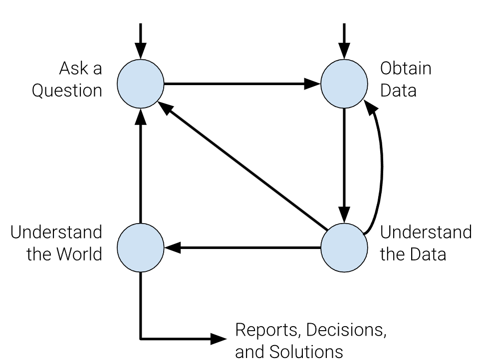

## Lecture 1
### Logistics
1. slido.com and the number is 3625952

### Intuition from case study of audited tax
Tax audited? how IRS know the race of taxpayers? How do we know who was audited? -> Data from IRS
* Race not reported anywhere in tax return.
* The prevalence of hometowns first names, last names differs across race and ethnicity. Visualize the factor as x axis and audited rate as y axis.
    * Race from hometown: NYC and SF. SF indicates higher probability that residents are identified as asian.
    * First name and last name: probability of particular name that is identified as black, asian, etc.
    * Income: single variable does not fully explain the gap in lower income data.
* The root cause is the algo prioritize the tax credit error over income underreporting error. -> Choosing a right metric to solve the problem.

Data science is to understand the world(Science) and solve problems(engineering)

### Data Science Lifecycle
We have two entry points: asking a question or obtaining data

Example about students' enrollment profile.
1. Start with a question: Some questions for majors, year, etc
2. Data Acquisition and Cleaning: `majors = pd.read_csv("data/major.csv")`
3. Explanatory of data analysis: Peeking the data by `majors.head(20)` and `names.head(20)`
4. 