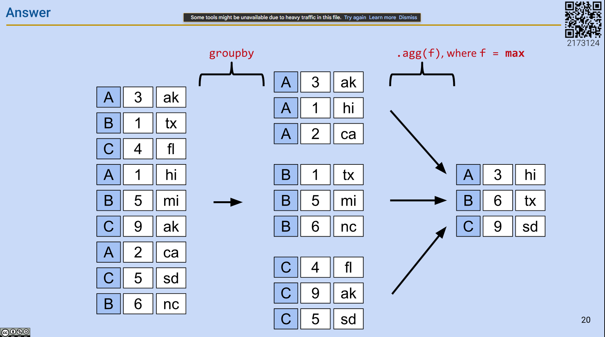

## Lecture 1
### Logistics
1. slido.com and the number is 3625952

### Intuition from case study of audited tax
Tax audited? how IRS know the race of taxpayers? How do we know who was audited? -> Data from IRS
* Race not reported anywhere in tax return.
* The prevalence of hometowns first names, last names differs across race and ethnicity. Visualize the factor as x axis and audited rate as y axis.
    * Race from hometown: NYC and SF. SF indicates higher probability that residents are identified as asian.
    * First name and last name: probability of particular name that is identified as black, asian, etc.
    * Income: single variable does not fully explain the gap in lower income data.
* The root cause is the algo prioritize the tax credit error over income underreporting error. -> Choosing a right metric to solve the problem.

Data science is to understand the world(Science) and solve problems(engineering)


### Data Science Lifecycle
We have two entry points: asking a question or obtaining data


Example about students' enrollment profile.
1. Start with a question: Some questions for majors, year, etc
2. Data Acquisition and Cleaning: `majors = pd.read_csv("data/major.csv")`
3. Explanatory of data analysis: Peeking the data by `majors.head(20)` and `names.head(20)`


## Lecture 2: Pandas I
### Tabular data
It's data in table.
* Row: one observation
* Column: features of the observation

Industrial data tool: pandas(panel data)
* Arrange data, extract info by filters, gain insights, add `numpy` function.

### Series
The table is called a `DataFrame`. We think as a collection of named columns, called `Series`. e.g. A `Series` named "candidate", "price", "location", etc.

A `Series` is a 1-dimensional array-like object.
* A sequence of values of the same type. Accessed by calling `s.values`
* A sequence of data labels, called the index. Accessed by calling `s.index`
  * Custom index: Provide index labels for items in a Series by passing an index list. `s = pd.Series([-1,10,2], index=["a","b""c"])`
* `s = pd.Series(["welcome, "to", "Data 100"])`

Selection in `Series`
* A single label. 
* A list of labels. `s[["a","c"]]`
* A filtering condition: we want to select values in the `Series` that satisfy a particular condition.
  * e.g. select all elements that are even. `even = (s%2 == 0)` The output will be a boolean type `Series` object.
  * Apply a boolean condition to the Series
  * Index into our Series using the boolean condition. `pandas` will select only the entries in the Series that satisfy that condition.

### DataFrame
We think of a `DataFrame` as a collection of `Series` that all share the same index.

Creating a `DataFrame`
* The syntax is `pandas.DataFrame(data, index, columns)`
* We can create it from:
    * CSV file. `elections = pd.read_csv("data/elections.csv")`
      * Use exact column as index: `elections = pd.read_csv("data/elections.csv, index_col="Year")`
    * using a list and column names
      * `pd.DataFrame([1,2,3], columns=["Numbers"])`
      * Passing by rows. `pd.DataFrame([[1, "one"], [2, "two"]], columns=["Numbers", "Description"])`
    * a dictionary
      * `pd.DataFrame({"Fruit": ["strawberry", "Orange"], "Price": [5.49, 3.99]})`
    * a Series
      * `s_a = pd.Series(["a1", "a2"], index = ["r1", "r2"])`
      * `s_b = pd.Series(["b1", "b2"], index = ["r1", "r2"])`
      * `pd.DataFrame({"A-column": s_a}, {"B-column": s_b})`
      * Turn a Series to a DataFrame. `pd.DataFrame(s_a)`

### Index
The index, not necessarily number, can also be:
* non-numeric
* having a name

The index is not necessarily unique.

Modify index:
* Make sure creating a copy of the DataFrame or rewrite to correctly reflect the operation. `elections = elections.set_index("Candidate")` or `elections.set_index("Candidate", inplace=True)`
* Use `elections.set_index(inplace=True)` to keep "Candidate" as one of the column

`columns`, `index`, and `shape` can be retrieved by calling `election.xxx`


### Relationship
We think of a `DataFrame` as a collection of `Series` that all share the same index.


### Takeaway
We explore the components of `DataFrame` which  is a collections of `Series` that all share the same index. We also learnt some basic operations on `Series` to analyze the data.


## Lecture 3: Pandas II
Utility functions in pandas
* Extracting data using `.iloc`
* Usage of `[]`


### `loc` V.S. `iloc`
`loc` function for label-based extraction
* `elections.loc[1:10, ["Candidate", "Party"]]`: parameters are [row label, column label] or 
* `elections.loc[[1, 2], ["Candidate", "Party"]]` for specific labels
* The row argument can not be skipped, while the column argument can skip to indicate all columns

`iloc` function for integer-based extraction
* The integer means the position of the data in the `DataFrame`, counting from the 0. Basically it's equivalent to the index.
* The arguments to `.iloc` can be
  * A list: `elections.iloc[[1, 2, 3], [1, 2]]` grab the exact data.
  * A slice(**exclusive** of the right hand side of the slice): `elections.iloc[[1, 2, 3], 0:3]`
  * A single value. `elections.iloc[[1, 2, 3], 1]`

When to use?
* Safer and Readable: For `loc`, if data gets updated, rows shuffle, column shuffle, we do not want to rely on the position index.
* Grab the median number in a sorted array or data. e.g. movie earning.

### `[]` square bracket
`[]` is for context-dependent extraction
* Only takes one argument, which may be
  * A slice of row numbers `iloc` A range of values->integer
  * A list of of column labels `loc`. `elections[["Candidate", "Party"]]`
  * A single column label `loc`

Why use?
* Make the code shorter

Chaining
* `weird['b'][1]` will give a whole column first and then choose the item

### Conditional Selection
how to automatically select `names[[True, False, True, True, False]]`?
* Create a `Series` as a boolean series to filter the `DataFrame`
  * `logical_operator = (names["Sex"] == 'F')`
* `loc` can also work: `names.loc[names["Sex"] == 'F', :]`

How to combine different conditions
* `&` is `and`, `|` is `or`: `names[(names["Sex"] == 'F') | (names["Years"] < 2000)]`
* Bitwise operation & | ^(XOR exclusive or) ~(not)


Alternatives to direct boolean array selection
* `.isin`: `names[names["Name"].isin(chosen_names)]` chosen_name is a list that is provided.
* `.str.startwith`: `names[names["Name"].str.startwith("N")]`

### Other operations on column
Adding a column:
* Use `[]` to reference the desired new column
* assign this column to a `Series` of the appropriate length
```python
babyname_lengths = babynames["Name"].str.len()
babynames["name_lengths"] = babyname_lengths
```

You can also:
* Modify a column `babynames["name_lengths"] = babynames["name_lengths"]-1`
* Rename a column `.rename(columns={"Original": "New"})`
* Drop a column/row `.drop("Label", axis="columns")`


### Utility functions
* Average number: `np.mean(variable)`
* `.shape` and `.size` is the capacity
* `.describe()` provides the summary of the `DataFrame`. Also, `names["Sex"].describe()` is also callable on `Series`
* `.sample()` random selection of rows from the `DataFrame`, it can be chained with `iloc` [Question] what is replacement?
* `.value_counts()` counts the number of occurrences of each unique value in a `Series`
* `.unique()` returns a array of every unique value in a `Series`
* `Series.sort_values()` equals `DataFrame.sort_values(by=column_name)`


## Lecture 4: Pandas III
### Custom Sort
Remember the method `names.sort_values(by="column_name", ascending=False)`.
* Approach 2: Use the `key` argument. `lambda x: x.str.len()` where x is the input.
* Approach 3: Use the `map` function.

### Grouping
Group together rows that fall under the same category. e.g. group together all rows from the same year. Or, you may use it to perform an operation that aggregates across all rows in the category, like sum up the total number of babies born in that year.
* `groupby()` + `groupby().agg(sum)`
* `sum`, `mean`, `max`... can be called in `agg`. Or customized functions can be called.
* `max` will affect all columns, which lead to an entire row of the max for the specific group.

* `groupby('Year').count()` returns the number in a group. null value will not be counted.
* Filter. `groupby().filter(f)` where `f = lambda sf: sf["num"].sum() > 10` sf is the whole table that is grouped. Output structure will be the same as the one before `groupby()` unless the elements are not been filtered.

### Pivot table
Group two or more columns of interest.


### Joining Tables
`pd.merge(left=xxx, right=xxx, left_on=, right_on=)` or `DataFrame.merge(right=xxxx, left_on=column_name, right_on=column)`

