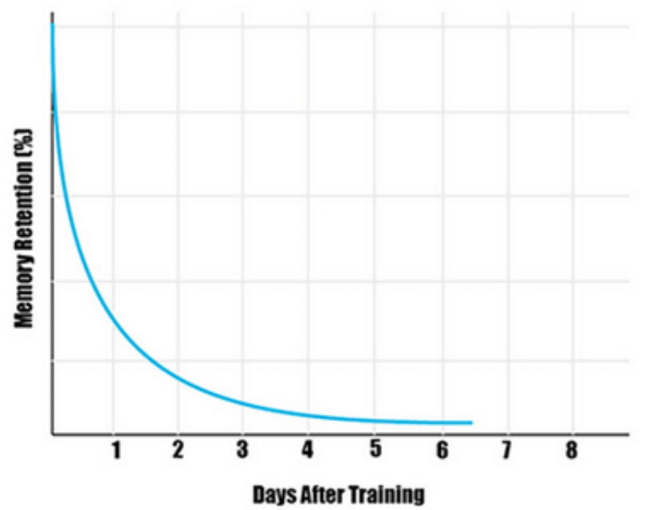

# ENGIN 295 Storytelling for engineers
The course will cover topics from Biography, informational interview, and opinion pieces to answer three questions: Who am I, What is my field, and What do I bring to my field.

## Why stories?
1. We human love stories..
2. Help others to see what we're seeing.
3. Help us open minds and hearts to others.
4. Open our minds and lead to action.

### How to use stories engage audience
1. The only skill of a storyteller is their ability to wield the weapon of suspense, making the audience eager to discover the next event in the sequence.
2. Training against memory retention.
    