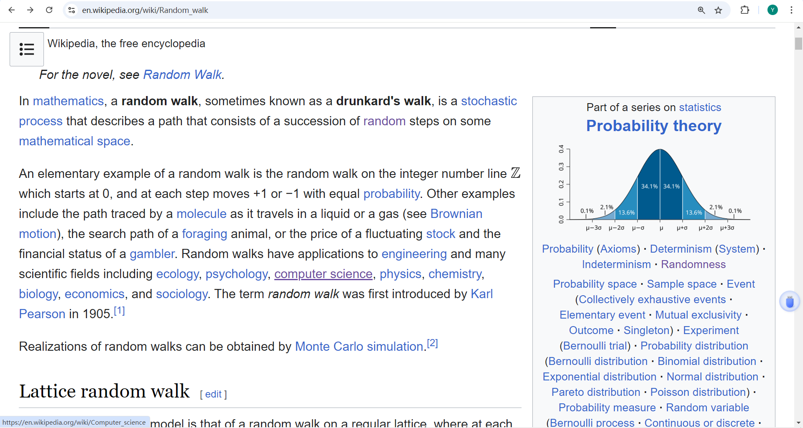

# Question Overview
Given two urls, return the shortest path(number of degree) linking one to the other.
The function of parsing the url is given, the return value is a `list` containing all urls of `related pages`.
> `Related pages` means the pages that can be reached by hyper links in the given url.

# Examples
### Example 1
Input:
```
url1 = https://en.wikipedia.org/wiki/Random_walk
url2 = https://en.wikipedia.org/wiki/Random_walk
```
Output:
```
Number of degree: 0
```
Explanation: 

`They are the same url, there's no link between.`

### Example 2
Input:
```
url1 = https://en.wikipedia.org/wiki/Random_walk
url2 = https://en.wikipedia.org/wiki/Planning
```
Output:
```
Number of degree: 2
```
Explanation: 
- The word `computer science` has a hyperlink(i.e. https://en.wikipedia.org/wiki/Computer_science) in the url1 as shown in the figure 1
    
- Click `computer science`, we get to a new page. Then the word `planning` has a hyperlink(i.e. https://en.wikipedia.org/wiki/Planning) as shown in the figure 2. Then click it we will get to url2.
     
- Before getting exactly to the url2, we click twice, so this defining the number of degree.

# Questions
1. Regardless of efficient, how to give a feasible solution.
2. What point should be cautious when using recursive method.
3. For test cases of 3 degree, which part causes long processing time? Searching matched url or getting the content.

# Reflection
0. BFS and DFS can be used. The `shortest` path should be considered for final output.
1. Always giving a feasible solution first, then optimizing.
2. Before coding, figuring out the input and the output.
3. If processing time is tedious, and the program always is hanging, be sure that do not stick to the search part. 
Take a look how you get the input which might be time-consuming as well. In this case, the parsing process takes a long time
for every url. So when searching the 3 degree links, it takes a huge time to parse each.