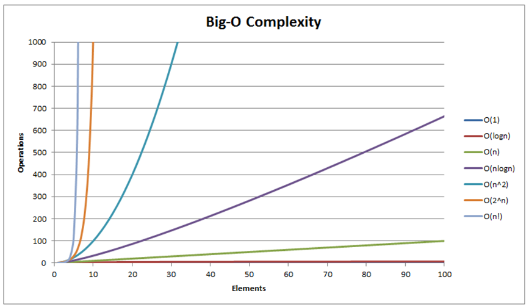
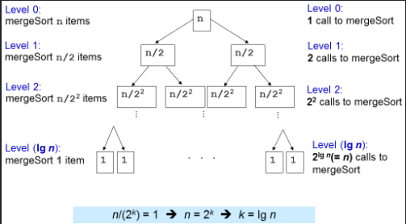

# Sorting
## 1 Motivation
Sorting is a very classic problem of reordering items (that can be compared, e.g., integers, floating-point numbers, strings, etc) of an array (or a list) in a certain order (increasing, non-decreasing (increasing or flat), decreasing, non-increasing (decreasing or flat), lexicographical, etc).
* Comparison versus non-comparison based strategies
* Iterative versus Recursive implementation,
* Divide-and-Conquer paradigm
* Best/Worst/Average-case Time Complexity analysis,
* Randomized Algorithms, etc.

When an (integer) array A is sorted, many problems involving A become easier.

### 1-1 Category
* Bubble Sort (comparison)
* Selection Sort (comparison)
* Insertion Sort (comparison)
* Merge Sort (comparison, recursive)
* Quick Sort (comparison, recursive)
* Random Quick Sort (comparison, recursive)
* Counting Sort (non-comparison)
* Radix Sort (non-comparison)

## 2 Analysis of Algorithm
Analysis of Algorithm is a process to evaluate rigorously the resources (time and space) needed by an algorithm and represent the result of the evaluation with a (simple) formula.

We can measure the actual running time of a program by using wall clock time or by inserting timing-measurement code into our program. **However**, actual running time is not meaningful when comparing two algorithms as they are possibly coded in different languages, using different data sets, or running on different computers.

Instead of measuring the actual timing, we count the # of operations (arithmetic, assignment, comparison, etc). This is a way to assess its efficiency as an algorithm's execution time is correlated to the # of operations that it requires. Knowing the (precise) number of operations required by the algorithm, we can state something like this: Algorithm **$X$** takes **$2n^2 + 100n$** operations to solve problem of size **$n$**

### 2-1 Only consider the leading term
Asymptotic analysis is an analysis of algorithms that focuses on analyzing problems of large input size n, considers only the leading term of the formula, and ignores the coefficient of the leading term.

We choose the leading term because the lower order terms contribute lesser to the overall cost as the input grows larger, e.g., for $f(n) = 2n^2 + 100n$, we have:
$f(1000) = 2*1000^2 + 100*1000 = 2.1M$, vs
$f(100000) = 2*100000^2 + 100*100000 = 20010M$.

### 2-2 Ignoring coefficient of the leading term.
Suppose two algorithms have $2n^2$ and $30n^2$ as the leading terms, respectively. 

Although actual time will be different due to the different constants, the **growth rates** of the running time are the same. Compared with another algorithm with leading term of $n^3$, the difference in growth rate is a much more dominating factor.

Hence, we can drop the coefficient of leading term when studying algorithm complexity.

### 2-3 Big-O Notation
If algorithm $A$ requires time proportional to $f(n)$, we say that algorithm $A$ is of the order of $f(n)$.

We write that algorithm $A$ has time complexity of $O(f(n))$, where $f(n)$ is the growth rate function for algorithm $A$.

The most common growth terms can be ordered from fastest to slowest as follows:
$O(1)$/constant time < $O(log n)$/logarithmic time < $O(n)$/linear time <
$O(n log n)$/quasilinear time < $O(n2)$/quadratic time < $O(n3)$/cubic time <
$O(2n)$/exponential time < $O(n!)$/also-exponential time < $∞$


## 3 $O(N^{2})$ Comparison-based Sorting
Examples are based on ascending order. From small to large.

They compare pairs of elements of the array and decide whether to swap them or not.
### Bubble Sort
1. Assume array length is N. Compare adjacent pair of items
2. Swap the item if they are out of order
3. Repeat step 1 and 2 until comparing the last pair(i.e. array[N-2] and array[N-1]), then the last item will be the smallest/largest one
4. Reduce comparison length by 1(i.e. from 0 to N-2, then 0 to N-3) until reduced to 1.

Code refer to [here](./bubbleSort.py)

### Selection Sort
Thoughts are similar to Bubble but w/ o/ several swaps.
1. Select the index of the minimal item.
2. Swap it with the **first** available index.
3. Repeat step 1 and 2 until the end

Code refer to [here](./selectionSort.py)

### Insertion Sort
Imagine you now have one poker card and gonnna pick several cards one by one.
1. Pick next card and compare it with the sequence of the last pick.
2. Insert it into the proper order.
3. Repeat 1 and 2.
* Best Cases: Sorted list, no shifting of the inner loop will be needed. $O(N)$
* Worst Cases: Reversed list, every inner iteration will run the whole array. $O(N^2)$

Code refer to [here](./insertSort.py)

## 4 $O(N\log{N})$ Comparison-based Sorting
* Merge Sort
* Quick Sort and its Randomized version.

These sorting algorithms are usually implemented recursively, use Divide and Conquer problem solving paradigm, and run in $O(N log N)$ time for Merge Sort and $O(N log N)$ time in expectation for Randomized Quick Sort.

### Divide and Conquer Paradigm
* Divide step: Divide the large, original problem into smaller sub-problems and recursively solve the smaller sub-problems,
* Conquer step: Combine the results of the smaller sub-problems to produce the result of the larger, original problem.

### Merge Sort
Merge Sort is a Divide and Conquer sorting algorithm.

The divide step is simple: Divide the current array into two halves (perfectly equal if N is even or one side is slightly greater by one element if N is odd) and then recursively sort the two halves.

The conquer step is the one that does the most work: Merge the two (sorted) halves to form a sorted array, using the merge sub-routine

#### Merge
Given an array of $N$ items, the **merge operation** in the **Merge Sort** will:
1. Merge each pair of individual element (which is by default, sorted) into sorted arrays of 2 elements,
2. Merge each pair of sorted arrays of 2 elements into sorted arrays of 4 elements, Repeat the process...,
3. Final step: Merge 2 sorted arrays of $N$/2 elements (for simplicity of this discussion, we assume that $N$ is even) to obtain a fully sorted array of $N$ elements.

Given two sorted array, $A$ and $B$, of size $N_1$ and $N_2$, we can efficiently merge them into one larger combined sorted array of size $N$ = $N_1$+$N_2$, in $O(N)$ time.
> This is achieved by simply comparing the front of the two arrays and take the smaller of the two at all times. However, this simple but fast O(N) merge sub-routine will need additional array to do this merging correctly.
```python
def mergeOperation(array, low, mid, high):
    # subArray1 = a[low, mid], subArray2 = a[mid+1, high]
    left, right = low, mid+1
    b = []

    while left <= mid and right <= high:
        if array[left] < array[right]:
            b.append(array[left])
            left += 1
        else:
            b.append(array[right])
            right += 1
    
    while (left <= mid):
        b.append(array[left])
        left += 1
    while (right <= high):
        b.append(array[right])
        right += 1
    
    for i in range(len(b)):
        array[low + i] = b[i] 
```
#### Complexity Analysis
When we call merge(a, low, mid, high), we process k = (high-low+1) items.
* There will be at most k-1 comparisons.
* There are k moves from original array a to temporary array b and another k moves back.

In total, number of operations inside merge sub-routine is < 3k-1 = O(k).


#### Pros and Cons
* The most important good part of Merge Sort is its $O(N \log{N})$ performance guarantee, regardless of the original ordering of the input. 
* Merge Sort is therefore very suitable to sort extremely large number of inputs as $O(N \log{N})$ grows much slower than the $O(N^2)$ sorting algorithms
* It requires additional $O(N)$ storage during merging operation, thus not really memory efficient and not in-place

#### Complete Implementation in Python
[Refer to here](./mergeSort.py)


https://visualgo.net/en/sorting?slide=11