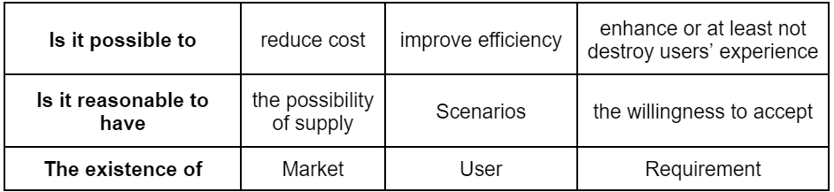
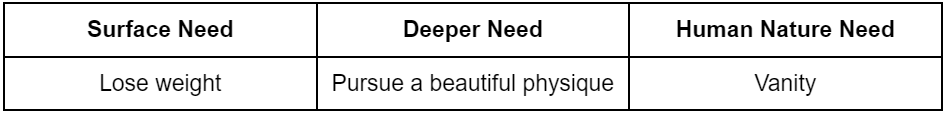
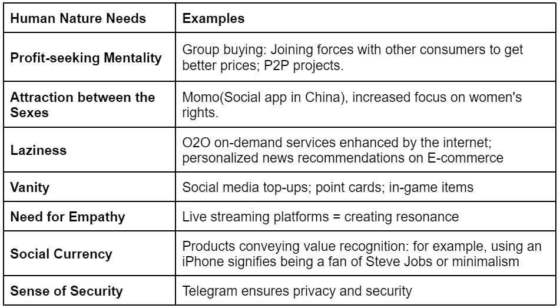
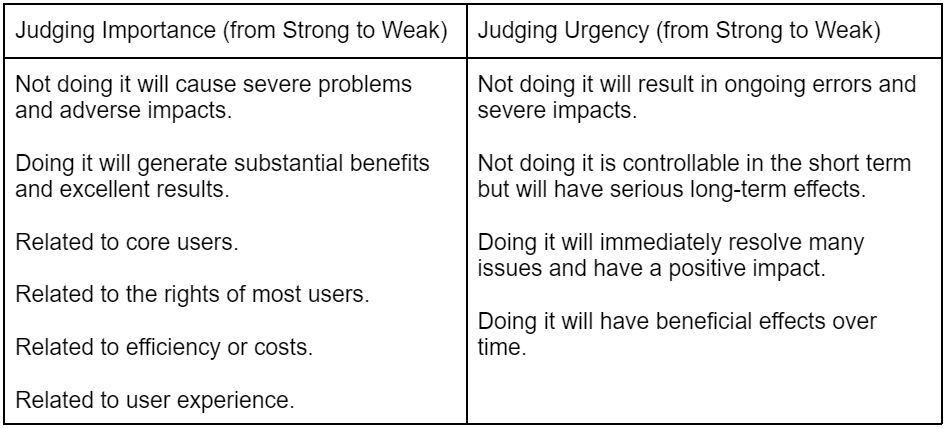
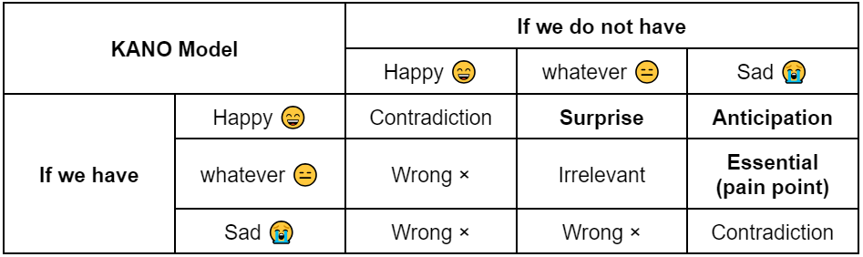

# Before Reading
  **The original review is written in Chinese, then translated by GPT-4o and checked by myself.**
* Original Chinese Version refer to [Chinese Version.](ChineseVersion.md) Updated on August 25, 2024
* More case examples are expected to update for better understanding and establish a sound team management system for Team [SRM](https://www.linkedin.com/company/shanghai-university-robomaster-srm/about/?viewAsMember=true)@Shanghai University
* Feel free to reach out to me to propose any relevant cases to fulfill this review.
> Index
> - Introduction
> - Summary
> - Evaluation and Commentary
> - Takeaways
> - Appendix-Supporting Materials

# Introduction
- Title: From the idea to the product 从点子到产品：产品经理的价值观与方法论
- Author: Fei Liu 刘飞
- Publisher: Electronic Industry Press 电子工业出版社
- Publish date: 2017.1
- ISBN: 978-7-121-30286-2

This book, from the perspective of a product manager, introduces the values and practical methodologies that a product manager needs throughout the entire cycle from idea to product. It helps better define product features, analyze requirements, foster team collaboration, and manage updates and iterations. In my view, this not only aids product managers in quickly getting started but also serves as a valuable supplement of soft skills for tech professionals, entrepreneurs, and student team leaders. It broadens your approach to considering problems, thinking mindset through issues, and finding solutions. If you’re looking for a roadmap to turn ideas into products, this book offers a comprehensive approach from conceptualizing ideas to creating actionable plans, along with management and collaboration techniques for producing usable products.
> PS: Hover over the image to view the caption

# Summary
A successful product creates value and solves the pain points of users. Based on the analysis of user requirements, features align with what users really want. To smoothen the implementation heading for requirements, the PM should clarify how to manage files, stages, and working streams. Then the entire team works on it, and some tricks in problem-solving, communication, and personal growth boost the whole life cycle.

Key words: methodology, values, Workflow

# Evaluation and Commentary
**Taking the internet as an example**, the purpose of any product is to "meet the various needs of users, thereby creating value." It requires someone to accurately analyze user experience demands, coordinate and drive the product development process, so that user problems are resolved while ensuring the company's strategic goals are successfully achieved.

 
 

**How do you launch a product based on its core value?** When discussing ideas and concepts, you should first focus on the product model to assess whether the logic behind fulfilling the needs is sound. This involves evaluating the rationality of the product design (using a **product model verification matrix** as shown in **Figure 1**), the feasibility of the business model, the scalability, and the practicality of implementation. <u>*It's essential to look beyond the glamorous appearance of a skyscraper and consider the state of the construction team behind it.*</u>

Based on the feasibility assessment mentioned above, it’s clear that simply creating a product for every need that comes to mind is unreasonable. The focus should be on identifying the core value of the product—how it truly addresses users' problems. The core value must be clear and should aim to enable users to achieve their goals quickly and effectively. It’s crucial to thoroughly analyze the users' problems and determine whether the issue being addressed is indeed a problem. When solving it, it’s best to exceed users' expectations.

Once the ideas and core values are clearly defined, you can use a Minimal Viable Product (MVP) to quickly and cost-effectively verify whether the product model and business model are feasible by evaluating:
1. Whether it meets user needs;
2. Whether it creates business value.

The earlier the product or module is in its development, the more it should focus on core functionality rather than trying to be all-encompassing. This is because the most appropriate way to ensure that the product model’s functionality is accepted by users is to quickly introduce it to the market for validation. The core value of the product is to solve user problems—by providing a solution quickly, you can acquire users sooner, and the product can be continuously improved to better address user pain points. MVP requires thoughtful consideration of the product model, ensuring that it is theoretically sound and practically proven. <u>*The MVP must have a clear function that can be explained in a single sentence.*</u>

 
 

**After the MVP is successfully validated**, it’s essential to continue refining the product based on further user needs. When digging deeper into these needs, it's important to distinguish between Wants and Needs. Wants are features that users hope to see in the product, while Needs are specific, concrete problems that the product must solve. By understanding the true demands behind these needs, you can focus on addressing the real issues that matter most to the users.

To identify these needs, user research is a valuable tool for understanding users and guiding us in designing and optimizing products based on the findings. This research typically involves both qualitative and quantitative methods to gather information and draw conclusions. Throughout the user research process, it's crucial to always remember: <u>*design the product as if you were a real user—design should never be done entirely from an office!*</u> 

Once you've confirmed that the user's needs are being addressed, the next step is to consider user experience. User experience focuses on ensuring that the product meets user needs in a way that is friendly, convenient, comfortable, and efficient. Here are 11 principles to consider:
1. Visibility Principle: ("Oh? Shouldn't there be some information here?" For example, a failed query on China Eastern Airlines without any error message.)
2. Contextual Relevance Principle: (Large icons in the Didi app - Uber in China - to enhance usability.)
3. Controllable: (The Home button increases the user's sense of security.)
4. Consistency: (Using consistent terminology, such as "followers" and "following.")
5. Error Prevention: (Providing sufficient warnings to prevent users from making mistakes or getting confused.)
6. Memory Aid: (Order confirmation before payment to help users remember their actions.)
7. Simplicity and Readability: (Avoid unnecessary complexity and flashy designs.)
8. Error Tolerance: (Providing undo functions and strong warnings.)
9. Help and Guidance: (Offering prompts in scenarios where users might encounter difficulties, like in a game when performing tasks, instead of just providing a comprehensive help document.)
10. Flexibility and Efficiency: (In WeChat, clicking the "+" button brings up the most recent photos, anticipating the user's next action.)
11. State Restoration: (Automatic save in the web version of Zhihu's editor; returning to the previous screen in iOS.)

 
 

**During Product Development**, the management of documentation, requirement updates, and workflows significantly impacts product performance. Product managers need to be familiar with problem-solving methods (such as design architecture, information flow, and data structures), though they don't necessarily need to be able to implement them immediately.
- Documentation: The purpose of documentation is to efficiently **convey the product manager's descriptions of product features** and to record them. Good documentation should meet the following criteria: no illogical expressions or unclear content arrangements, no undefined details, and intuitive readability. Typically, you can start by trying to describe the source of the requirements, the development timeline, the technical points involved, and the personnel on a single page. As the documentation system matures and the team becomes familiar with it, you can gradually revise and streamline the document structure.
- Requirements: The lifecycle of a requirement determines the process from design to implementation of the product. The handling of requirements involves several stages: requirement gathering, discussion and allocation, feasibility review, development, and retrospective. The gathering of requirements should involve judgment and recording for ease of future reference. The basis for judgment includes:

  1. The importance of the requirement itself (Is it more important to correct the spelling of "login" to "log in" or to correct a reward from 15 to 50?).
  2. The source (Is it from the target user?).
  3. The background of the requirement (Has the reason been clearly explained? Is the logic clear? Has it actually been encountered?).

    The problem + solution format can be used for recording (e.g., "When using the xx feature, xx felt xx, so we could try xx"). The discussion usually revolves around the priority of the requirements. The **four-quadrant rule** or the **KANO model** can be used to reasonably evaluate and persuade others. For specific discussion methods, allocation, and feasibility review, refer to the support material at the end of the document under "Documentation Management/Requirements."
  
  

- Workflow: Avoid the following issues: 
  1. Tasks that you are doing should be assigned to someone else; 
  2. Tasks that you are doing can be handled more efficiently to avoid redundant work. 
  
    As a leader, you may not need to perform the tasks of a team member, but you should understand their work. During collaboration, address problems within a reasonable and acceptable range for everyone, rather than simply proving who is right or wrong from a logical standpoint.

 
 

**In managing the complete product lifecycle**, the author of the book introduces some techniques and methods that I believe are not only applicable to product management but also offer guidance for managing one's own life. Any situation that does not meet expectations should be considered to determine if it genuinely needs to be resolved.
- Handling Issues: We should proactively identify problems. Problems need to be presented with their background, the people involved, and the expected outcomes. When analyzing issues, it's important to abstract the problem, similar to digging into deeper needs, and be aware of thinking traps (such as anchor traps, sunk-cost traps). Identifying and analyzing problems focuses on the matter, while solving them focuses on people. Break complex problems into smaller, manageable issues based on layers, steps, and logic, as this increases efficiency. Each solution should include:

  1. A clear understanding of the problem and its background;
  2. Unambiguous solution content;
  3. A responsible person for the solution;
  4. Stages of the solution (align with the breakdown of sub-problems, set goals for sub-problems, and conduct phased validation using OKR tools).

    Set goals and validation methods to evaluate the effectiveness. Finally, ensure execution by making sure collaborators receive all necessary information and understand the attitudes of their peers. Regularly monitor, test the results, and conduct retrospectives.

- Communication: Good communication skills involve:

  1. Quickly and accurately understanding the information expressed by others;
  2. Clearly and fluently conveying your own information;
  3. Addressing issues while considering others' emotions.

    Distinguish between facts (objective occurrences) and opinions (subjective viewpoints). Typically, accept and believe facts as information for yourself while maintaining skepticism towards opinions. Ensuring understanding can be achieved by having the other party restate their points (for SRM, it is very useful). In communication, if you notice unusual or confusing language or behavior, the best approach is to discuss it directly rather than making hasty judgments or overinterpreting.

- Aesthetics: If a work is sufficiently beautiful, people may appreciate it from different perspectives. However, if it is unattractive, individuals with a sense of aesthetics can identify the same flaws. Explore designer websites like Dribbble and Behance for inspiration.

 
 

**Finally**, regarding interest and enthusiasm, product or team managers should be responsible:

- Be Present for Important Events: Ensure attendance at significant occasions (e.g., when critical development is happening late at night, major competitions). They should be present at any situation where their presence might be needed.
- Resolve Issues Impacting Progress: Address conflicts that could hinder progress (e.g., disagreements between team leaders and management over design plans should be mediated proactively to prevent delays).
- Fill Missing Gaps: Step in to handle tasks that are needed but not being done (e.g., setting up chairs, managing stalls, or moving equipment).

When considering whether you lack interest, reflect if it's due to encountering difficulties. Understanding the root causes of wanting to leave a team is crucial. Overcoming current challenges and continuously striving to address more will lead to becoming proficient in the task at hand.

# Takeaways:
### Ideas and Solutions
An idea alone does not have inherent value. A feature described in a single sentence is meaningless. Ideas should be refined into detailed plans with robust product models and business strategies that are scalable and feasible within the team's capabilities.

### Uncovering Needs
Good products address actual user problems rather than just keeping users engaged. Creating value for users is essential. In Silicon Valley, many entrepreneurs decide to start a business first and then determine what to do. What keeps you motivated is knowing that what you’re working on is creating real value.

### MVP
Product models and core feature design guide the product, while MVP is the practical methodology. Avoid over-designing a complex and unrealistic solution. The first step should be taken quickly to test whether the idea is valid. MVPs often need adjustment based on feedback and findings, and the early product design should focus on simplification. Completing the process does not necessarily require a full online launch.

### Deep-Dive Users' Needs
Use first principles to understand the essence of needs, rather than comparing with others' solutions, which only leads to incremental iterations. User research quality is measured by its support for product optimization. Be cautious of data traps in quantitative research and seek to understand underlying reasons in qualitative research. Becoming a user yourself is the best research method.

### User Experience
There is always room for improvement in any feature. Good products are not dependent on a single innovative idea but on meticulous attention to detail. Any aspect that feels potentially uncomfortable could cause widespread dissatisfaction.

### Documentation Management
Product managers should understand technology to better design functions and collaborate, not to perform technical tasks. Good documentation is logical, complete, and describes background and principles of requirement realization.

### Requirement Management
[Requirement management focuses on tools and no specific personal viewpoints.]

### Workflow Management
Continuously ask yourself: Am I doing the right things? Am I using effective methods? What can I do to improve efficiency?

### Problem Solving
Treat all work-related matters as problems to be solved, which helps cultivating structural thinking and clearly identify and address each issue's status. Structured thinking also helps depersonalize emotional problems.

### Communication
Basic communication skills involve understanding and conveying information clearly. Advanced skills ensure that communication issues are not affected by emotions or mindsets. Top-level communication skills not only facilitate information exchange but also leverage opportunities to achieve goals and enhance work through others.

### Growth
Organize and structure your knowledge and materials, treating yourself as a product to be iterated and improved.

### Interest and Enthusiasm
A good product aims to make the world a better place. Internally, we should have ambitious goals while being grounded in practical work.

In summary, reading alone does not lead to mastery. Applying what you learn to your situation, absorbing and practicing it, is what drives growth. Aim for a balance of ambitious vision and practical action to make significant contributions.

 
 
 
 
 
 
 

# Appendix - Supporting Materials(From opinions in the book)
> - 📕 Main Point: The central idea or key message of the text.
> - 😀 Subpoint: Supporting arguments or details related to the main point
> - 🔥 Mistake: Incorrect practices or approaches.
> - 💧 Solution: Correct methods or remedies to address mistakes.
> - 😭 Example of Mistake: Specific examples illustrating incorrect practices.
> - 😄 Example of Solution: Specific examples demonstrating effective solutions.

## Recommendation:
The essence of the internet is to “meet a variety of user needs and thereby create value.” This requires accurate analysis of user experience needs, coordination to achieve results, responsibility for user experience, and ensuring that the company's strategic goals are met. The methodology for creating new positions is essential.

## Product Value and User Pain Points (How to Launch a Product from Core Value)
### Ideas and Solutions
📕 First, discuss the product model, i.e., whether the logic of meeting the needs is feasible. Consider the rationality of product design (product model verification matrix), profitability, scalability, and implementation feasibility.

- 😀 Use “why would users want to use your product” as the core consideration, utilizing the product model verification matrix.
- 🔥 Defining a large, comprehensive platform and then retroactively considering how current functions fit in.
  * e.g., Music training with music school information and training materials. The school's need is exposure; why not use a review platform?
- 💧 Reduce assumptions and constraints, and judge feasibility.
  * e.g., Didi Chuxing: Information symmetry, carpooling to improve transport efficiency, and lower costs.

---
- 😀 Choose a suitable business model focusing on the product’s core value. Consider the cost of acquiring users (willingness to use) and the cost of user retention (staying). Profitability should cover these costs. Options include advertising, sales (STEAM), value-added services (skins, early access), enterprise services (data provision), differentiated services (paid Q&A), commissions (Tmall), tips, and easier access (cloud storage).
- 🔥 Avoid focusing on peripheral features for quick profits.
- 😭 Zhihu used traffic to build a membership system, neglecting high-quality contributors and content.
- 💧 Add features based on high-quality contributors, such as annotations and paid lectures, to leverage high-quality content.

---
- 😀 Assess the feasibility of expansion, including market trends (policy, technology, competition/scale), changes in user characteristics, changes in product logic (additional features after user accumulation, potential for expanding into related fields), and scalability of the business model.
- 😭 The feasibility of expanding a smartphone is much stronger than that of scissors or combs.

---
- 😀 Determine which products and features are easy to handle, which are challenging, and which are out of reach. Understand “why you are doing this?” to clarify “do you have the capability to execute this plan?” and “what is your advantage over others?”
- 🔥 Don’t focus solely on creating the “best” product without considering if you have the capability to build it. ***Don't only see the splendor of the skyscraper without considering the condition of the construction team.***
- 
### Find Out What Users Really Want
📕 It is unreasonable to build everything based on every idea; instead, identify the core value of the product that can solve user problems. The core value should be clear and help users to leave satisfied! Analyze user problems thoroughly to ensure that you are solving real issues and aim to exceed user expectations.

- 😀 The core value is that if users leave, the problem is not genuinely solved. It helps discover the optimal (most recognized by users, most commercially valuable) features, unify logical functionality design, and make users aware of the product.
- 🔥 Many entrepreneurs are well-versed in concepts, ideas, and knowledge from successful predecessors, learning how to package and attract users. While this knowledge is valuable, it may divert attention from truly solving user problems and focus instead on making things aesthetically pleasing.
- 💧 Keep asking: What is the significance of this for the user?

---
- 😀 A good product solves the problem and allows users to leave immediately.
- 🔥 Don’t sacrifice product logic consistency just to improve metrics.
- 😭 You buy furniture not because of quality, but because of gifts. Adding small red dots on the website to increase activity and usage frequency but sacrificing user experience.
- 😄 WeChat solves social interactions among acquaintances, while Momo addresses social interactions among strangers based on interests.

---
- 😀 The quality of users is more important than quantity. When a solution seems possible but is poor in practice (e.g., new features requiring extensive testing to ensure user familiarity), or feasible but inefficient (e.g., adding visually appealing animations that cause lag), or addressing unnecessary problems (e.g., excessive reminder volume for delivery products), it’s crucial to address real issues.

---
- 😀 Since there is a cost for users to switch to your product, problems should be solved beyond expectations. The benefits of exceeding expectations (X) need to be greater than the psychological and actual costs of switching (Y1 and Y2, such as registration time and membership points), ensuring X > Y1 + Y2.

### MVP and Pain Points
📕 The Minimal Viable Product (MVP) is a low-cost method to validate whether a **product model** and **business model** are feasible. It involves: 1. Meeting user needs; 2. Creating commercial value. Early-stage products or modules should focus on core functionalities rather than being all-encompassing. To ensure that the functionalities designed in the product model are accepted by users, it's best to quickly launch them to the market for validation. The core value of a product is to solve user problems, and the sooner it's available to users, the quicker it can address their pain points through continuous optimization. MVPs require theoretical consideration of the product model and practical proof of its validity.

> "Don’t use tactical diligence to cover up strategic laziness." — Lei Jun

- 😀 An MVP must balance usability with minimal cost. First, create a basic version with essential features (like a sparrow) before developing a comprehensive version (like an eagle).
- 💧 Occam's Razor: List the expected complete solution, start removing the least important features until only the essential functionality remains; User Interviews: Test the minimum viable version through demos or presentations; Remove functions that can be handled **manually**: e.g., early delivery services were managed manually; Ensure only one feature: ***Make sure the product has only one core function that can be explained in one sentence.***

---
- 😀 Test the designed MVP through various methods like advertising, mock websites, offline implementations, or pre-sale crowdfunding to gauge user acceptance.

---
- 😀 In the process of developing the MVP, choose platforms with low development and dissemination costs (e.g., current mini-programs); Participate in designing technical solutions (decide on the cost and benefits of implementation, whether some features can be omitted or simplified, or if third-party plugins can be used).

---
- 😀 After identifying pain points, it is time for in-depth demand exploration and rapid iteration. Standards for identifying pain points include: 
  - observing quantitative data (usage frequency, daily active users, user retention/re-purchase rate, payment conversion rate—how many registered users are willing to pay, LTV/CAC > 3, where LTV is the lifetime value of the user and CAC is the cost of acquiring the user);
  -  qualitatively analyzing user feedback (e.g., forums, social media, Q&A sites);
  -  conducting interviews about previous products used, whether problems were solved, willingness to pay, etc. Data can reveal the logic behind growth or reasons for user dissatisfaction.
- 😄 Successful Case: Airbnb, facing low transaction volumes, realized users needed pre-selection judgments for homes. They introduced photographers to take pictures for hosts, leading to a significant increase in user volume.
- 💧 MVP should focus on core features and determine advanced features based on research, data, and interviews.
    

## Requirement Analysis and Feature Design（how to design new features with users' new needs in the product development）
### Dive-deep users' needs
📕 Distinguishing between Wants and Needs is crucial. Wants are features users would like to see, while Needs are specific problems that the product must solve. Understanding the true underlying needs is essential.

- 😀 Scenario-Based Approach: Immerse yourself in real user scenarios and discuss needs based on data and examples, rather than relying solely on common sense and logical assumptions. Consider specific scenes, particular users, and real events rather than formulas, charts, or quotes. Think about the time, place, task, plot, and environment. How and under what circumstances does the user solve the problem? Immersing in the scenario helps more accurately identify whether a demand is genuine or a pseudo-need.
- 🔥 Example: A food information product targeting international travelers, modeled after user preferences like avoiding cooking, meeting friends considering distance, and seeking authentic high-rated Japanese food, did not experience significant user growth.
- 💧 Solution: The problem was with the scenario. For international travelers, it's not just about walking more but about finding "unique" or "delicious" options.

---
- 😀 Human Nature Perspective: Looking from a higher perspective helps understand the deeper human needs behind surface demands.
- 😄 Example: Surface Need: Weight loss; Deep Need: Desire for an attractive physique; Human Nature Need: Vanity.
    

### User Research
📕 User Research is a method to understand users and guide product design and optimization based on research findings. It involves gathering information through both qualitative and quantitative approaches.

- 😀 Define Objectives: Before collecting information, determine what aspects of the user need to be understood. User research should be designed considering three aspects: ensuring the objective is met (whether subjective or objective information is needed), rational design, and sample control.
- 🔥 Common Mistake: User research is not just about conducting surveys; it is not merely about sending out questionnaires.

---
- 😀 Surveys: Focus on obtaining objective information. However, surveys are not sufficient for in-depth and systematic understanding. Control the sample by checking the distribution channels and verifying whether respondents match the target demographic.
- 🔥 Design Issues: 
  * Avoid leading questions (e.g., “Do you think red is better than yellow?”). 
  * Ensure questions are clear (e.g., “Does this feature solve your xxx problem?”). 
  * Avoid sensitive topics without shifting the focus (e.g., “For infidelity, which side do you lean towards?”). 
  * Minimize open-ended questions and ensure option reliability (e.g., avoid excessive “other” options). 
  * Avoid too many questions and cross-validate important questions.
- 🔥 Example: Early election polls conducted via phone may be skewed as they might only reach wealthier individuals, leading to inaccurate conclusions.

---
- 😀 User Interviews: Focus on subjective opinions and are suitable for in-depth insights. Design interviews to uncover real needs and issues causing discomfort from the desired features. Sample selection should involve dividing user groups and finding representative individuals.

---
- 😀 Usability Testing: Conduct this after MVP implementation but before launch, with time for adjustments. Focus on whether the product solves users' problems and if there are any confusions or negative emotions.

---
- 😀 Data Analysis in User Research: Examine user behavior on the product. In addition to direct metrics, use A/B testing and field studies. Field studies involve designing products close to real users and engaging in product design rather than just working from an office.
- 🔥 Common Mistake: Knowing only the number of users without understanding their satisfaction with features.
- 🔥 Common Mistake: Focusing only on whether work is being done without assessing whether it is being done correctly.
- 💧 Key Data Points:
  - Launch Frequency: Indicates user engagement.
  - Timing of Usage: Shows user contexts (e.g., pre-bedtime reading).
  - Event Completion: Analyzes functionality (e.g., browsing to payment).
  - Error Occurrence: Measures process friendliness.
  - User Activity: Measures product acceptance (e.g., retention rate, willingness to pay).
  - User Attributes: Analyzes user composition (e.g., WIFI vs. 4G, iOS vs. Android).

---
- 😀 Output Conclusions: User research should yield valuable conclusions, such as detailed user profiles and interview summaries. Quantitative conclusions involve analyzing data results.
- 🔥 Data Trap: Low user click-through rates do not necessarily indicate a poor feature. For example, a delivery app with low usage might reveal that:

  - Feature positioning aligns with expectations.
  - Experienced users find it helpful.
  - Many riders do not use it frequently.
  - Issues include poor guidance, unclear visual effects, and outdated heat maps.
- 💧 Application: Use the conclusions to guide further optimization.

### User Experience
📕 User Experience (UX): Focuses on ensuring that the product meets user needs in a convenient, comfortable, and efficient manner.

- 😀 11 UX Principles:
  - Visibility: Ensure users notice important information (e.g., clear error messages).
  - Scenario Relevance: Align features with real use cases (e.g., large icons for navigation).
  - Controllable: Provide users with a sense of security (e.g., home button functionality).
  - Consistency: Use uniform terminology (e.g., “followers” vs. “following”).
  - Error Prevention: Provide sufficient warnings to prevent mistakes.
  - Memory Assistance: Confirm actions before proceeding (e.g., order confirmation).
  - Simplicity: Avoid unnecessary complexity.
  - Fault Tolerance: Offer undo functions and clear warnings.
  - Help and Hints: Provide context-specific assistance (e.g., in-game hints).
  - Efficiency: Anticipate user actions (e.g., quick access to recent photos).
  - Recovery: Ensure users can return to previous states (e.g., auto-save).

---
- 😀 Copywriting: Should be clear and unambiguous rather than just engaging. Simplify text and avoid ambiguity.
- 💧 Validation: Use trial users to verify the effectiveness of the copy.

## Product Management
### Document
📕 Documentation: Product managers need to understand the methods for solving problems (e.g., design architecture, information flow, data structure) but do not need to implement them immediately.

- 😀 Purpose of Documentation: To efficiently convey and record product functionality. Good documentation should be logically coherent, free of undefined details, and have high readability.
- 💧 Ensure Logical Structure:
  - Functional Framework: Enumerate and integrate all potential functions.
  - Business Process Logic: Use flowcharts and state transitions.
  - Functional Descriptions: Detail logic and consequences (e.g., order cancellation policies).

### Requirement
📕 Demand Lifecycle: Manages the transition from product design to implementation. The process includes gathering requirements, discussing and assigning, feasibility review, development, and review.

- 😀 Requirement Gathering: Document and evaluate requirements for future reference. Criteria include:
  - Importance of the requirement.
  - Source (e.g., target user).
  - Background (e.g., clarity of reasons and logic, actual encounters.
    Document in a problem + solution format (e.g., "User felt XX feature was inadequate; we could try YY").
- 🔥 Common Mistake: Not specifying the reason, logic, or actual usage. Avoid recording requirements if these are unclear or not based on real scenarios.

---
- 😀 Requirement Discussion: Prioritize requirements using methods such as the Four Quadrant Method or KANO Model for effective evaluation and persuasion.
  
  
    After discussing priorities, review the rough solutions for addressing different requirements. Decide on the solutions to implement, weigh their pros and cons, and ensure consensus on the chosen solution(s). Assign a responsible person for each solution (who will be accountable for the requirement, including testing and progress tracking, and will assume responsibility for any issues that arise). Set deadlines (with the longest time frame not exceeding one week to ensure progress), and once a batch of requirements is discussed, follow up by organizing the next batch and tracking the status of ongoing requirements.

---
- 😀 After determining the solution, conduct a feasibility review as soon as possible. Confirm technical feasibility with the development team, check for better alternatives (solutions provided by technical staff are often feasible but may not be complete), and evaluate costs. The review will typically yield a more rigorous and actionable solution.

---
- 😀 During the development phase, create a two-dimensional matrix by combining the prioritized requirements from various sources (P) and the prioritized requirements after feasibility review (D). Analyze the cost-effectiveness of the requirements to guide development.

### Workflow
📕Avoid: 1. Doing tasks that should be handled by others; 2. Overlooking methods to avoid redundant work. As a leader, you may not need to perform the tasks of a team member, but you must understand their work.

- 😀 Collaboration: When issues arise, resolve them within a reasonable scope rather than proving who is right or wrong logically. Collaborate based on the principle of mutual benefit. Achieve basic consensus privately before meetings, and ensure meetings produce conclusions or solutions with documented discussion points and decisions.

---
- 😀 Process Management: Systematize and standardize collaboration processes; reduce manual labor; make work reusable; avoid repeating mistakes.
- 💧 Example: Monthly simulation reports reduce manual labor; internship documentation outlines who to consult and what to deliver at each stage, standardizing processes and avoiding repeated mistakes; creating scenario-based documentation with a strong framework and prompts for reuse.
Techniques and Methods

---
- 😀 For any issues not meeting expectations, consider whether they are genuinely needed to be solved.
Problem Handling

---
- 😀 Proactively identify problems: Present problems with background information, stakeholders, and expected solutions!
- 🔥 Issues like poor collaboration with technology, unpopular features, or vague documentation are not complete problems.
- 💧 For instance, if collaboration issues lead to frequent delays, the problem might be a misalignment in feasibility assessments; if user adoption is low, the problem might be with feature design or marketing; if documentation is too brief, the problem could be unclear logic or missing details.

---
- 😀 When analyzing problems, abstract to identify the core issues causing complex problems. Use logical analysis with these considerations:
  - Avoid assuming direct correlations without evidence (e.g., frequent visits to a foot massage parlor does not necessarily indicate better health).
  - Clarify ambiguous concepts (e.g., distinguish between a shipment and an order).
  - Utilize logical relationships like AND, OR, NOT (e.g., consider both the A and NOT A scenarios).
  - Beware of false assumptions; initial assumptions might be incorrect, and many solutions may be viable.
  - Avoid making definitive statements without exploring other possibilities.
  - Base conclusions on data and evidence rather than subjective experience.
  - Avoid generalizing from isolated cases; ensure findings are universally applicable.
  - Be cautious with statistics; for example, a rise in average salary due to one high-income individual does not mean all individuals have higher incomes.
- 🔥 Addressing dissatisfaction with technical team collaboration requires eliminating distrust; it's crucial to rebuild trust.
- 🔥 If the team lacks motivation, avoid immediate incentives or team-building activities. Instead, identify the underlying issues, such as personal circumstances, salary dissatisfaction, or lack of challenge.

---
- 😀 When discovering and analyzing problems, focus on the issue itself. For solutions, focus on people. Break down complex problems into smaller ones and address them individually. Each solution should include:
Problem and background for better understanding;
  - Clear and actionable solution content;
  - Designated responsible person;
  - Solution phases (corresponding to sub-problems), objectives, and validation methods for assessing effectiveness. Ensure execution by providing all necessary information, understanding collaborators' perspectives, and regularly monitoring and reviewing outcomes.

### Communication
- 😀 Effective communication involves: 
  1. Quickly and accurately understanding others' information; 
  2. Clearly expressing your own information;
  3. Discussing the matter while considering others' emotions.
- 💧 Understanding: If someone's communication is lengthy, interrupt appropriately to get to the key points. Confirm understanding by summarizing (e.g., "I understand there are three key points: first, xxx; second, xxx; third, xxx"). Distinguish between facts and opinions, **accepting facts as information while remaining skeptical of opinions**.
- 💧 Expression: Clearly state your main points. Outline key points first, provide a brief overview, and then elaborate. **Spontaneous Retelling** to ensure understanding. At the beginning, clarify your objectives (e.g., "I want to discuss xx topics and come up with a solution"). Use visual aids like whiteboards or paper to structure and explain.
- 💧 Communication mindset: **If you notice unusual behavior or expressions from collaborators, address it directly through conversation instead of making assumptions or overinterpreting**. Avoid focusing on winning or losing, and refrain from bringing up past disagreements in a negative light.

### Growth
- 😀 Aesthetic Appreciation: If a work is aesthetically pleasing, people may appreciate it from different perspectives, but if it's unattractive, experts will agree on its flaws. Explore design sites like Dribbble and Behance.
  - Demand Analysis: Design and execute a comprehensive demand discovery plan based on product positioning and market conditions (including purpose, methods, and presentation).
  - Product Design: Use demand analysis and theoretical methods to design excellent products (not just usable).
  - Project Tracking: Lead project scheduling and prioritize tasks to ensure quality upon release.
  - Industry Knowledge: Systematically summarize and organize industry knowledge.
- 💧 Focus on “If you were in this position, how would you do it?” Consider details in team management and provide specific, quantifiable descriptions in projects.

### Interest and Passion
- 😀 Product or team managers should be responsible:
  - Attend important events (e.g., crucial development stages or major competitions).
  - Address issues impacting progress (e.g., resolving disputes between team members).
  - Fill gaps when necessary (e.g., handling tasks like shipping chairs or managing stalls).
- 🔥 When feeling disinterested, reflect on whether it's due to encountering difficulties. Understanding the root causes for wanting to leave the team is important.
- 💧 Overcome current difficulties and continuously tackle more challenges. Over time, you’ll find you are highly skilled in that area.
