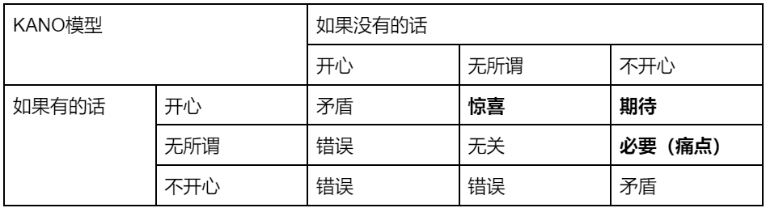

**The English version comes soon**
> Index
> - 介绍 Introduction
> - 概述 Summary
> - 评价和重要观点 Evaluation and Commentary
> - 你能带走什么 Takeaways
> - 附录-支持性材料 Appendix-Supporting Materials
# Introduction
- 书名: 从点子到产品：产品经理的价值观与方法论
- 作者: 刘飞
- 出版社: 电子工业出版社
- 出版日期: 2017.1
- ISBN: 978-7-121-30286-2

本书以产品经理的视角，介绍了从点子到产品的完整周期中，产品经理所需具备的价值观和可以实践的方法论，以帮助更好地定义产品功能、分析需求、团队合作、更新迭代。依我看来，这不仅可以帮助产品经理快速入门上手，对于技术从业者、创业者、学生团队管理者也是很好的软技能补充，开拓考虑问题的维度、思考问题的思路和解决问题的方法。如果你在寻找如何将想法落地到产品的roadmap，本书可以为你提供从点子具化到可以实施方案的思路，和产出可用产品过程中的管理、合作技巧。
> PS: 鼠标悬浮图片查看题注

# Summary
成功的产品能够创造价值，并解决用户的痛点。基于对用户需求的分析，产品功能应与用户真正想要的内容对齐。为了顺利实现这些需求，产品经理应明确如何管理文件、阶段和工作流。然后，整个团队将围绕这一点展开工作，一些在问题解决、沟通和个人成长方面的小技巧可以促进整个生命周期的发展。

# Evaluation and Commentary
**以互联网为例**，任何产品的意义是“满足用户各式各样的需求，从而创造价值”，需要有人对用户体验需求正确分析、 协调推动产品出现，从而解决用户问题的同时，保证公司的战略目标顺利达成。

 

**如何从核心价值出发launch一个产品**？在讨论想法和点子时，先要讨论产品模型来判断在思路层面是否合理，即：需求实现的逻辑，是不是行得通。考虑产品设计的合理性（判断方法论：产品模型验证矩阵如图1所示）、盈利模式合理性、拓展合理性和实施合理性，不能只看到高楼大厦的光鲜，而不考虑背后施工队的状况。

基于上述合理性的判断，显然想到什么需求就做什么是不合理的，要发现产品的核心价值，到底如何可以解决用户的问题，核心价值要清晰，帮助用户用完即走！用户的问题要分析清楚，明确到底要解决的是不是问题。解决时最好可以超出用户预期。想法和核心价值评判清晰后，可以通过Minimal Viable Product来快速、低成本验证产品模型和商业模式是否可行，通过：
  1. 是否满足用户需求；
  2. 是否能创造商业价值。

越是早期的产品或模块，就越是要关注核心功能，而非面面俱到。因为，为了确保产品模型设计的功能得到用户认可，将其快速投入市场中进行验证是最妥当的方法；且产品的核心价值是解决用户问题，只要能解决问题，越快提供给用户，就能越快获得这些用户，产品会在不断优化中更好击中用户痛点。MVP需要产品模型的思考，它需要在理论上成立，在实践中证明。MVP务必确保其功能清晰到用一句话就能说清楚。

 

**MVP验证成功后**，需要继续根据用户进一步的需求进行完善。首先，在深挖需求时，区分Want and Needs，前者是希望在产品中看到的功能，而Needs则是确定的具体问题需要产品去解决，由此关心需求背后真正的诉求。

获取这种需求的方法，可以通过用户研究，它能够协助我们理解用户，并以研究得到的结论，指导我们设计产品和优化产品的方法，一般通过定性和定量两个方面获取信息，输出结论。用户研究过程中，始终牢记：让自己成为真正的用户去设计产品，设计，永远不应该坐在办公室里做！！再进一步，确认解决用户需求后，需要考虑用户体验，用户体验关注的是让产品友好地满足用户需求，让用户通过产品，满足需求的同时足够方便、舒适和快捷。11个原则以供参考：

1. 可见原则（“哦？这里不应该有介绍吗？”东航查询失败毫无提示原因）；
2. 场景贴近原则（滴滴出行的大图标）；
3. 可控原则（Home键提升用户安全感）；
4. 一致性（粉丝-关注者等用词）；
5. 防错防呆原则（有足够的提醒，不让用户犯错和发呆）；
6. 协助用户记忆原则（支付前确认订单）；
7. 简约易读原则（切忌花哨）；
8. 容错原则（提供撤销功能和强烈提示）；
9. 帮助和提示（考虑需要进行复杂操作的情况并提示，如游戏中做任务，在卡关可能场景中出提示接口，而不是放一个完整的帮助文档）；
10. 灵活高效原则（微信点击加号弹出刚拍的照片=预判用户下一步的动作）
11. 恢复现场原则（知乎网页版编辑的自动保存；iOS返回上一界面）

 

**开发产品过程中**，对于文档、需求更新、工作流的管理对产品性能影响显著。对于产品的管理者，需要熟悉解决问题的手段（例如设计的架构、信息流动、数据结构），但不一定需要能立马上手实现（Suspect）。
- 文档：文档的作用是高效传递产品管理者对产品功能的描述并记录。好的文档应满足：没有逻辑不通的表达和逻辑不明的内容安排；没有未定义清楚的细节；直观的可读性。通常，可以先尝试以一页纸，描述清楚需求来源、开发时间线、涉及技术点和人员即可，文档体系成熟、人员熟悉后，再逐步删改文档结构。
- 需求：需求的生命周期决定了产品的设计到实现。需求的处理分为几个阶段：获取需求-讨论和分配-可行性评审-开发-复盘。需求的获取应当做判断和记录，方便回溯。判断依据是
    1. 需求本身的重要性（登录写为登陆重要，还是奖励15写成50重要）
    2. 来源（是否是目标用户）
    3. 需求背景（是否说清原因；是否说清逻辑；是否实际遇到）。
   
   采用问题+方案的形式记录（xx在用xx功能时，感觉xx，我们可以尝试xx）。讨论的通常是需求优先级。可以用四象限法则或KANO模型合理考量和说服他人。具体的讨论方法、分配、可行性评审见文末support material/文档管理/需求

  
  

- 工作流：避免：1.你做的事情应该是别人做的；2.你做的事情有避免重复劳动的方法。作为船长，你可以不去做水手的工作，但不能不理解水手的工作。协作过程中：遇到问题要让大家在情理都可以接受的范围内解决掉，而不是从逻辑上证明谁对谁错。

 

**管理产品完整周期过程中**，该书作者还提出了一些技巧和方法，我认为不仅对产品，对于管理自己的人生也有一定指导意义。任何达不到预期的事情，都要考虑是不是真实需要解决的。
- 处理问题：我们要主动发现问题：问题的提出需要有问题的背景，问题涉及的人和解决问题的预期！分析问题时，要善于抽象问题，即发现导致复杂问题发生的本质（如前述对深层需求的挖掘一样），运用逻辑分析时，要注意一些thinking trap（anchor trap, sunk-cost trap…）。发现问题和分析问题时面向的是事，而解决问题面向的，则是人。按层次、步骤、逻辑，将复杂问题拆分为一个个小问题，单独解决的效率会高很多。针对每个问题设计的解决方案，要包含
  1. 问题和背景以加深理解；
  2. 不模棱两可的方案内容；
  3. 方案的负责人；
  4. 方案的阶段性（和前述拆分子问题对应，为子问题设立目标，阶段性验证。OKR工具）

    目标和验证方法以评判达到怎么样的效果算可以。最后推动执行，确保协作者获取到所有信息并了解协作者的态度，定期关注并检验效果和复盘。
- 沟通：好的沟通能力是
    1. 快速准确理解他人表达的信息；
    2. 准确通畅地表达自己想传递的信息；
    3. 理解和表达中就事论事，也能照顾他人的情绪。
    要善于区分事实（已经发生的事实）和观点（带有主观色彩），通常接受和相信事实，吸纳为自己的信息，while对观点保持怀疑，同时，可以通过让对方重述（SRM很好用）确保对方理解。沟通的心态：发现协作方言语和举止的怪异或者让你有疑惑，最好的方式就是找他沟通一下，聊一聊，不要贸然下判断和过度解读。
- 审美：如果一个作品足够美，那大家喜欢它的角度可能不同，但如果很丑，懂的审美人就能找到同一个丑的地方。逛逛dribbble, Behance的设计师网站。

 

**最后的最后**，对于兴趣和热情，产品或团队的管理者要有责任心
- 不缺席重要场合（重要节点的配研发人员熬夜、重要比赛场合等）。任何“可能需要”他在的场合，他都应该在。
- 排除影响进度的问题（组长和管理层对设计方案吵架，主动劝和，否则影响进度）
- 主动填充缺失环节，某件事情没有人做但又需要人去做的时候，能充当临时替补（如经纬汇搬椅子、摆摊看摊位、货拉拉搬航空箱）

当每次想说没有兴趣的时候，要反思是不是只是因为遇到了困难。很重要，多次想要退队的根因。克服掉这一次的困难，再不断去尝试克服更多困难，长期以往，就发现在这件事情上足够擅长了。

# Takeaways:
### 点子与方案
点子不代表着任何意义。单纯一句话的功能也没有意义。爱因斯坦相比于庞加莱的空间相对性、光速不变假设等更精准更完整，有可靠的实验结果。因此，要把点子细化为方案，有健全的产品模型和商业模式，并在时空中具有延展性、在团队能力上能够匹配，才有价值。

### 发掘需求
好的产品能够解决用户的实际问题，而非故意黏住用户。为用户创造价值，才是有意义的功能。在硅谷，很多人是先决定创业，再决定做什么。真正能让你坚持下去的，是清楚知道：你在做的事情正在创造价值。

### MVP
产品模型和对核心功能的设计是产品的指导思想，而MVP是实践的方法论，切忌埋头设计出一套太过完整却不切实际的方案，要尽快迈出第一步，验证自己想法的对错。MVP很难一击即中，要在检验中判断产品有没有解决问题，进而及时发现疏漏，快速转向。产品初期设计要多做减法！跑通流程并不一定要在线上完成。

### 深挖需求
运用第一性原理理解需求本质，去满足这个本质，而不是用“比较思维”去看别人已经做过了或者正在做的事情，我们也去做，如此只能产生细小的迭代。
用户研究：用户研究的好坏和标准难以界定，但关键在于是不是能够支持产品的优化工作。量化研究要警惕数据陷阱；定性研究要发掘背后原委，最好的研究就是自己成为用户。

### 用户体验
任何功能都有变得更好的余地，好的产品不是依靠某个神奇的idea就能所向披靡，好的产品往往都是在任何细节都无可挑剔。任何你觉得可能会“不太舒服”的地方，在市场上很可能会让成千上万人不舒服。

### 文档管理
产品管理者了解技术是为了更好地设计功能和协作而不是帮技术同事完成工作。好的文档应是逻辑性强，具备完整性的，并对背景、需求实现原则有一定描述。

### 需求管理
【产品管理-需求 偏工具，无观点】

### 工作流管理
时刻问自己：我在做的事情正确吗？我在用好的方式做吗？我能用什么办法让它更高效？

### 处理问题
工作学习事务中的所有事物看作是处理问题，是很好的结构化思维，运用这种思维，就能清晰了解自己有多少事情要处理，它们都处于什么状态。同时，通过结构化，可以将一些带有情绪的问题去情绪化。

### 沟通
最基础的沟通能力：倾听理解+顺畅沟通，信息就不太会失真和低效。再高阶一些的沟通能力是不会因为情绪和心态而造成沟通中的矛盾。顶级沟通能力是不仅让信息通达，还能利用这些沟通机会通过别人来实现之间的目的，让别人促进自己的工作。

### 成长
学会把自己的知识点和资料结构化整理，把自己当成产品去迭代成长。

### 兴趣和热情
好的产品is to make the world a better place。在内心里，我们要有更远大的追求，在实际工作中，则要脚踏实地做产品。

To sum up，读多少书都入不了门，能把汽车驾驶员手册倒背如流，就能开车了吗？结合自己的实况找出自己有益的部分，吸收消化去实践，才会成长。心有猛虎，有做出让人惊羡产品的愿景；也可细嗅蔷薇，对这个世界充满善意和期待。

 
 
 
 
 
 
 

## 附录-支持性材料（来源为书中观点）
> - 📕表示主旨观点
> - 😀表示分论点
> - 🔥表示错误做法
> - 💧表示解决方案
> - 😭表示错误做法的具体例子
> - 😄表示解决方案的具体例子
### 推荐序Recommendation: 
互联网的意义是“满足用户各式各样的需求，从而创造价值”，需要有人对用户体验需求正确分析、协调推动结果出现、对用户体验负责，同时保证公司的战略目标顺利达成，催生新岗位的方法论。

### 产品价值和用户痛点（如何从核心价值出发launch一个产品）
#### 点子与方案
📕先要讨论产品模型，即：需求实现的逻辑，是不是行得通。考虑产品设计合理性（产品模型验证矩阵）、盈利模式合理性、拓展合理性和实施合理性。

- 😀以“用户到底为什么要用你的产品”作为核心思考点，采用产品模型验证矩阵。
- 🔥先定义未来大而全的平台，再去倒推考虑现在的功能怎么配合。
    * e.g. 音乐培训，音乐学校信息+培训教材。但学校需求是曝光度，为什么不是大众点评。
- 💧减少假设、限制，判断是否合理
    * e.g. 嘀嘀打车，信息对称、拼车提高运载效率、付费更少

---
- 😀选择合适的商业模式，聚焦于产品的核心价值，要考虑用户获取（愿意用）的成本和用户活跃（留在这儿）成本，盈利需要覆盖成本的模式才是合理的。广告、售卖（STEAM）、增值服务（皮肤、爱奇艺抢先看几集）、企业服务（提供数据）、差异化服务（值乎付费问答）、佣金（天猫）、打赏、更易获取（云存储）
- 🔥绕开核心价值，选择边缘功能赚快钱
- 😭知乎利用流量做会员体系，忽略高质量的答主和内容
- 💧基于高质量答主，为其添加标注，开启付费讲座等基于高质量内容的功能
---
- 😀判断拓展的合理性，包括市场的变化趋势（政策、技术、市场竞争/规模）、用户特征的变化、产品逻辑的变化（当前需求的解决是否可以有更多功能、用户沉淀后是否会有更多需求、本产品功能是否可以拓展到相近的领域）、商业模式的拓展性。
- 😭手机的拓展合理性就比剪刀和梳子的拓展合理性强很多。
---
- 😀判断哪些产品和功能做起来得心应手、哪些吃力、哪些遥不可及。想清楚“为什么是你们做？”来明确“你们有能力做这个方案吗”和“你们比其他人的优势是什么”
- 🔥不能只顾做“最好的”产品，却不考虑是不是有能力做这样的产品。***不能只看到大厦的光鲜，而不看施工队的状况。***

#### Find out what users really want
📕想到什么需求就做什么是不合理的，要发现产品的核心价值，which can 解决用户的问题。核心价值要清晰，帮助用户用完即走！用户的问题要分析清楚，明确到底要解决的是不是问题。解决时最好可以超出用户预期。

---
- 😀核心价值是用户离开它，就不能真正解决问题。它可以帮助发现最优（最受用户认可、最有商业价值）的功能、辅助逻辑统一的功能设计、让用户对产品产生认知。
- 🔥很多创业者深谙各种成名前辈所讲的概念、思路和知识，学到了如何包装和吸引用户，这些知识本身没有问题，但会让大家把注意力从真正关注的地方转移掉，不去试图真正解决用户的问题，而只考虑如何做得精美。
- 💧Keep asking: 这对用户有什么意义

---
- 😀好的产品是用完即走的，解决了问题，用完即走。
- 🔥不能为了指标的提升而牺牲产品逻辑的一致性。
- 😭你买家具并不是因为品质好，而是因为送礼品。网页上放小红点以提升活跃度、使用频率，但牺牲了用户体验，反而在制造问题
- 😄微信解决熟人社交，陌陌基于兴趣解决陌生人社交

---
😀用户的质比量重要。没有真正解决问题的情况：方法看似可以，实际很糟糕（新增功能，需要添加大量测试题确保用户熟悉了解）；方法看似可以，但可行性很差（添加看似美观的动画，但导致画面卡顿）；方法看似可行，但问题却不需要解决（快递配送产品提醒音量巨大且连续，这不需要优化）

---
😀因为有让用户心甘情愿转移到自己产品上的成本，因此要超预期的解决问题。超预期给用户带来的好处X，需要大于转移的心理成本和实际成本（注册花费时间、原本会员积分）的Y1和Y2，确保X>Y1+Y2

#### MVP与痛点
📕（Key point of this chapter)Minimal Viable Product是低成本验证**产品模型**和**商业模式**是否可行的手段，通过：1.是否满足用户需求；2.是否能创造商业价值。越是早期的产品或模块，就越是要关注核心功能，而非面面俱到。因为，为了确保产品模型设计的功能得到用户认可，将其快速投入市场中进行验证是最妥当的方法；且产品的核心价值是解决用户问题，只要能解决问题，越快提供给用户，就能越快获得这些用户，产品会在不断优化中更好击中用户痛点。MVP需要产品模型的思考，它需要在理论上成立，在实践中证明。
> 不要用战术上的勤奋，掩盖战略上的懒惰。——雷军

- 😀（sub-point）一个MVP需要达到 可用 与 最小成本 的平衡。先做五脏俱全的麻雀，再做所向披靡的雄鹰。
- 💧（Method or Solution)奥卡姆剃刀法：列出预期的完整方案，从最不重要的功能开始砍，直到再砍下去正常功能就无法使用为止；用户访谈：用户能接受最低限度的版本Demo或PPT；去掉**可以**人工处理的功能：外卖初期由人工给商家打电话订餐；**确保只有一个功能：务必确保只有一个功能，用一句话就能讲清楚。**

---
- 😀将设计好的MVP通过广告、假网页、线下实现、预售众筹等形式调研用户对MVP是否买账

---
- 😀实现MVP的过程中要选择开发成本低、传播成本也低的平台（现在的小程序）；参与设计技术实现方案（决策实现的成本和收益，是否可以不做或只提供简单版本或用第三方插件）

---
- 😀发现痛点后，才是深挖需求快速迭代的时机。判断是否发现痛点需要一些标准：观察定量数据（使用频次、日活跃用户、用户留存/复购率、付费转化率-注册用户有多少愿意付费，LTV/CAC>3 用户终身价值即整个时间周期中与产品互动产生的价值/获取用户的成本）；定性地分析用户反馈（贴吧、微博、豆瓣、知乎），访谈内容可以是之前用什么产品、解决问题了吗、接受收费吗......基于数据，可以发现增长背后的逻辑或不爱用的原因；
- 😄（Successful case）Airbnb在成交量不乐观后，发现了用户需要在选择房屋前有事前判断，故引入摄影师为屋主拍摄，用户量显著增长。
- 💧MVP聚焦核心功能，通过调研、数据、访谈确定进阶功能
  
    

        
    

### 需求分析和功能设计（如何在产品完善进程中通过用户需求设计功能）
#### 深挖需求
📕区分Want and Needs，前者是希望在产品中看到的功能，而Needs则是确定的具体问题需要产品去解决。由此关心需求背后真正的诉求

- 😀场景角度出发：将自己置身真实用户场景基于数据和实例讨论需求，而非用常识和逻辑推断。需要想到具体的画面、具体的某个用户、具体发生的真实事件，而非公式、图表、前辈的语录。时间、地点、任务、情节、环境，用户在什么情况下解决问题，怎么解决。代入场景，能更准确判断哪些需求是伪需求或若需求。
- 🔥面向境外旅游的美食信息产品，仿照大众点评基于用户不想做饭、约见朋友考虑距离、寻求正宗好评日料的功能，但用户增长并不乐观
- 💧问题出在场景上，国外旅游不在于多走些路，更在意“有特色”或“好吃”。

---
- 😀从人性角度看，是更高的视角，能够知道表层需求背后的人性需求。
- 😄表层需求：减肥，深层需求：追求体态优美，人性需求：虚荣心
    

#### 用户研究
📕用户研究：是能够协助我们理解用户，并以研究得到的结论，指导我们设计产品和优化产品的方法，一般通过定性和定量两个方面获取信息，输出结论。

- 😀获取信息以前，要先判断自己要了解用户的什么。用户研究的设计要从三个方面考量：确保达到目的（需要主观信息还是客观信息）、合理设计、把控样本。
- 🔥用户研究不单单是用户调研，绝对不是纯粹的发发问卷

---
- 😀问卷调查是用户研究中的一种聚焦于获取客观信息（目的）的方式，在深入性、系统性上，问卷是不够的。样本上，通过发放渠道和判断根据填写者必要信息是否符合目标群体进行把控。
- 🔥设计上：问题切忌具有引导性（你认为红色比黄色好看吗），问题中切忌有含糊不清的内容（你认为这个功能好用吗？->这个功能解决了你xxx的问题吗），在涉及敏感话题时转移主体（对于外遇，有人接受有人反之，你更倾向于哪个），少用问答题，确保选项可靠（太多人选“其他”就说明不可靠），切忌问题过多，重要问题交叉验证。
- 🔥早期选举民调通过电话，但有电话的都是有钱人，导致结论不准确。

---
- 😀用户访谈更关注主观观点，难量化，但适合深入和具体。访谈的设计要从受访者想要的feature中，发掘背后的的真实需求和造成困扰的原因。样本通过划分用户群后找对应代表进行。

---
- 😀可用性测试通过在“MVP实现后，上线前，有可修整的时间”的情况下进行，关注用户对产品使用过程中1.是否真正解决他们的问题；2.是否有困惑和负面情绪。

---
- 😀用户研究中的数据分析要关心用户在产品上行为。除了直接看指标，还可以采用A/B测试和实地考察的方式调研和分析数据。实地考察就是设计的产品要离用户足够近，让自己成为真正的用户去设计产品，设计，永远不应该坐在办公室里做！！
- 🔥只知道有多少用户，但这些用户到底喜不喜欢这个功能，一概不知。
- 🔥只关心自己是否在做事，但从不关心自己做得对不对
- 💧关注的数据：
  - 启动次数=用户粘性；
  - 何时观看=用户使用场景（睡前读物）；
  - 事件完成情况=分析功能优劣（浏览-加入🛒-确认订单-支付-完成）；
  - 使用出错情况=流程友好性；
  - 用户活跃情况（数量-留存率-付费意愿）=产品认可度；
  - 用户属性（WIFI or 4G, iOS or Android)=用户组成

---
- 😀用户研究需要输出结论，定性的结论一般是有价值的观点，如附带多维度属性的用户画像（M的M5竞品调研），访谈后生成的纪要（用户对功能A困惑较大，原因是）；定量的结论则是对数据的分析结果。
- 🔥注意避免数据陷阱：用户点击率低未必是功能差。外卖骑手订单热力分布软件使用率不高，访谈后，得到结论：1.功能定位符合预期；2.对熟悉功能的骑手，接单有帮助；3.一半以上骑手不经常用；4.问题集中在：引导性差、视觉效果不明显、热力时效性低。
- 💧根据上述的结论，对后续优化大有帮助。

#### 用户体验
📕用户体验关注的是让产品友好地满足用户需求，让用户通过产品，满足需求的同时足够方便、舒适和快捷。

- 😀11个原则以供参考：
  - 可见原则（“哦？这里不应该有介绍吗？”东航查询失败毫无提示原因）；
  - 场景贴近原则（滴滴出行的大图标）；
  - 可控原则（Home键提升用户安全感）；
  - 一致性（粉丝-关注者等用词）；
  - 防错防呆原则（有足够的提醒，不让用户犯错和发呆）；
  - 协助用户记忆原则（支付前确认订单）；
  - 简约易读原则（切忌花哨）；
  - 容错原则（提供撤销功能和强烈提示）；
  - 帮助和提示（考虑需要进行复杂操作的情况并提示，如游戏中做任务，在卡关可能场景给出提示接口，而不是放一个完整的帮助文档）；
  - 灵活高效原则（微信点击加号弹出刚拍的照片=预判用户下一步的动作）
  - 恢复现场原则（知乎网页版编辑的自动保存；iOS返回上一界面）

---
- 😀文案的选择要让用户理解含义而非体现趣味。能简则简；反复斟酌避免歧义。
- 💧通过找到产品的试用者验证文案。

### 产品管理
#### 文档
📕对于产品的管理者，需要熟悉解决问题的手段（例如设计的架构、信息流动、数据结构），但不一定需要能立马上手实现（Suspect）。

- 😀文档的作用是高效传递产品管理者对产品功能的描述并记录。好的文档应满足：没有逻辑不通的表达和逻辑不明的内容安排；没有未定义清楚的细节；直观的可读性。
- 💧确保文档逻辑，从功能框架的逻辑（拆分或枚举所有可能的功能+整合），业务流程逻辑（事件泳道流程图+状态转化），功能描述逻辑（取消订单的逻辑，几次会有什么惩罚，谁取消的可以wavie惩罚，通过表格形式描述）

#### 需求
📕需求的生命周期决定了产品的设计到实现。需求的处理分为几个阶段：获取需求-讨论和分配-可行性评审-开发-复盘

---
- 😀需求的获取应当做判断和记录，方便回溯。判断依据是1.需求本身的重要性（登录写为登陆重要，还是奖励15写成50重要）2.来源（是否是目标用户）3.需求背景（是否说清原因；是否说清逻辑；是否实际遇到）。采用问题+方案的形式记录（xx在用xx功能时，感觉xx，我们可以尝试xx）。
- 🔥不说清楚原因：你做个xx出来，别管那么多；不说清楚逻辑：啊，这里我也没搞懂，你先看看；不是实际遇到的：哎，我觉得可能有人会这样用）。如此情况，需求都别记。

---
- 😀讨论的通常是需求优先级。可以用四象限法则或KANO模型合理考量和说服他人。
  
  
    优先级讨论后对解决需求的不同解决方法的粗略方案进行讨论，做哪几个，优劣在哪儿，确保共同认可某个（些）方案后；指定负责人（对需求负责，包括测试和进度跟踪，出了问题他要承担责任）；划定时间点（最长的时间周期不要超过一周，保证推动进度），一批需求讨论完后，在整理讨论下一批和已经在处理的需求状态跟进。
---
- 😀确定方案后，实施前，尽快进行可行性评审。和研发部门确定技术可行性，是否有更好的方案（技术人员提供的方案往往可行性较高，但未必很完整），成本如何。评审后往往就能输出相对严谨且可执行性较高的方案。

---
- 😀开发阶段，通过将来自各方的需求排序集合P和可行性评审会后的需求排序集合D做成二维矩阵图，分析需求性价比，进行开发。

#### 工作流
📕避免：1.你做的事情应该是别人做的；2.你做的事情有避免重复劳动的方法。作为船长，你可以不去做水手的工作，但不能不理解水手的工作

- 😀协作：遇到问题要让大家在情理都可以接受的范围内解决掉，而不是从逻辑上证明谁对谁错。以“对大家都有利”的原则进行协作。开会前私下可以讨论达成基本共识，凡是会议就要输出结论或方案，对讨论的节点和结论进行记录。

---
- 😀流程管理：让协作流程化、标准化；减少手工劳动；让一些工作可复用；避免重复犯错
- 💧M的monthly simulation repoer减少手工劳动；产品实习生文档，什么阶段应该找什么人，应该输出什么内容，让流程标准化，避免重复犯错；撰写某个场景标注文档，确立可读性较强的框架和提示，让这项工作可复用。

### 技巧和方法
- 😀任何达不到预期的事情，都要考虑是不是真实需要解决的。

#### 处理问题
- 😀主动发现问题：问题的提出需要有问题的背景，问题涉及的人和解决问题的预期！
- 🔥跟技术协作不够好；xx功能上线不受欢迎；文档写的太简略。都不是完整的问题
- 💧跟技术的协作在可行性评审中出了问题，导致开发经常延期（预期是不延期）；功能A上线后用户使用率只有10%，至少应该达到50%；文档写的太简略，要补充逻辑流程图

---
- 😀分析问题时，要善于抽象问题，即发现导致复杂问题发生的本质。运用逻辑分析时，要注意几个方面：
  - 不要先入为主认为两件事肯定有关联，可能只有相关性(常去足疗店的人身体健康)；
  - 概念有歧义（运单和订单针对的主体不同，要明晰定义后再分析，一个运单-对配送员而言，可能有多个订单）
  - 熟练运用逻辑关系-与或非（考虑A场景时，也要考虑非A场景），善于对多次出现的问题归纳出原理，再用演绎的方法解决更多问题。
  - 警惕错误假设。对问题的假设最初可能就是错误的，我常常会假设某个事情完全不可控，但没想到可以用很多可以配合的方案避免这个不可控。
  - 警惕轻易断言。这个问题只有两种方法，选哪个？很多事情只是我们没想到更好的解决方案。
  - 不可太过主观臆断，要数据和其他证据的支撑，“我见多了”极不可取。
  - 不可以片面归纳，即从独立的特例推理出普世的道理。
  - 警惕统计数据。如一个10个人的微信群平均年薪是10w，新加入了一个100w的，平均数涨了，但大家并没有更有钱；一个小镇的车祸数量翻了两番，听起来很可怕，但只是从1变成了4；一个城市的车祸数量仅增加了1%，但基数很大，比4可怕多了。
- 🔥产品经理和技术人员因为需求改动而产生反感，本质是技术部门对产品经理产生了不信任感，消除不信任感是关键。
- 🔥团队干劲不足，别着急发福利、团建，去抽象问题的本质，可能是大家诉求不同，有人家里有变故要多关怀，有人对工资不满要沟通涨薪，有的人觉得工作不够有挑战要想办法调整岗位。

---
😀发现问题和分析问题时面向的是事，而解决问题面向的，则是人。按层次、步骤、逻辑，将复杂问题拆分为一个个小问题，单独解决的效率会高很多。针对每个问题设计的解决方案，要包含
  1. 问题和背景以加深理解；
  2. 不模棱两可的方案内容；
  3. 方案的负责人；
  4. 方案的阶段性（和前述拆分子问题对应，为子问题设立目标，阶段性验证。OKR工具）目标和验证方法以评判达到怎么样的效果算可以。最后推动执行，确保协作者获取到所有信息并了解协作者的态度，定期关注并检验效果和复盘。

#### 沟通
- 😀好的沟通能力是1.快速准确理解他人表达的信息；2.准确通畅地表达自己想传递的信息；3.理解和表达中就事论事，也能照顾他人的情绪。
- 💧理解：遇到对方表达信息的冗长，可以适时打断“不好意思，你说的这些背景我大概了解，你可以直接说关键的部分”。理解别人的表达后，通过复述，向对方确认“好的我听下来总结有三件事，第一xxx，第二xxx，第三xxx”。善于区分事实（已经发生的事实）和观点（带有主观色彩），通常***接受和相信事实，吸纳为自己的信息，while对观点保持怀疑。***
- 💧表达：表达前明确重点。先说有几件事，再说每件事的简要概述，最后展开讲解。可以通过**让对方重述（SRM很好用**）确保对方理解，为了确保对方理解，可以在最开始表达自己的诉求，如我想跟你沟通xx件事，我们要讨论出一个方案；我就是想告诉你xx件事，你只需了解xxx。可以的话，通过白板或纸梳理环节、流程和结构，更易于理解。
- 💧沟通的心态：***发现协作方言语和举止的怪异或者让你有疑惑，最好的方式就是找他沟通一下，聊一聊，不要贸然下判断和过度解读***！！！！！！切忌避免关心协作者之间的输赢，讨论当初的分歧，“你看，早就跟你说了，你现在服了吧”，“要不是我坚持，就跟你一起错下去了”这种傻逼话，不要讲。

#### 成长
- 😀审美：如果一个作品足够美，那大家喜欢它的角度可能不同，但如果很丑，懂的审美人就能找到同一个丑的地方。逛逛dribbble, Behance的设计师网站。
  - 需求分析：根据产品定位和市场状况，设计并执行一套完整的需求挖掘方案（包括目的、形式、展示结果）
  - 产品设计：通过需求分析和更多理论方法，设计出优秀的产品（而非仅是可用）
  - 项目跟进：主导项目的进度安排和优先级排序，确保上线品质
  - 行业知识：系统化总结和整理行业知识
- 💧更多关注“如果是你，你这么做”、团队管理的细节、项目中具体的量化描述。

#### 兴趣和热情
- 😀产品或团队的管理者要有责任心
  -    不缺席重要场合（重要节点的配研发人员熬夜、重要比赛场合等）。任何“可能需要”他在的场合，他都应该在。
  -    排除影响进度的问题（组长和管理层对设计方案吵架，主动劝和，否则影响进度）
  -    主动填充缺失环节，某件事情没有人做但又需要人去做的时候，能充当临时替补（如经纬汇搬椅子、摆摊看摊位、货拉拉搬航空箱）
- 🔥当每次想说没有兴趣的时候，要反思是不是只是因为遇到了困难。很重要，多次想要退队的根因。
- 💧克服掉这一次的困难，再不断去尝试克服更多困难，长期以往，就发现在这件事情上足够擅长了

