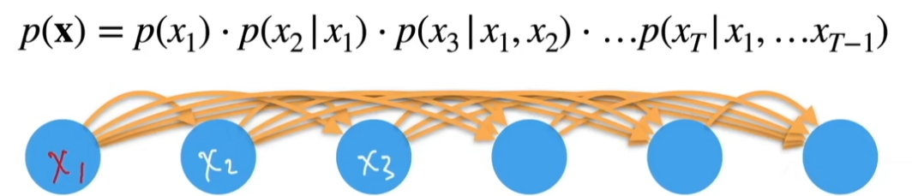

# Sequence Model
## Data Example
1. Music, video, and language.
   *  A dog bites a man V.S. A man bites a dog
2. Small earthquakes may follow by big ones.   
3. Film reviews will change by award, seasonal period, and negative news report.

## How to model this type of Data
1. 在时间t观察到$x_t$，得到$T$个**不独立**的随机变量，对$p(X)$建模，$(x_1, ..., x_T)\sim p(X)$。看概率分布，得到数据背后产生的机制。
2. 联合概率$p(a,b)$用条件概率展开，$p(a,b)=p(a)(b|a)=p(b)p(a|b)$
    
3. 对前